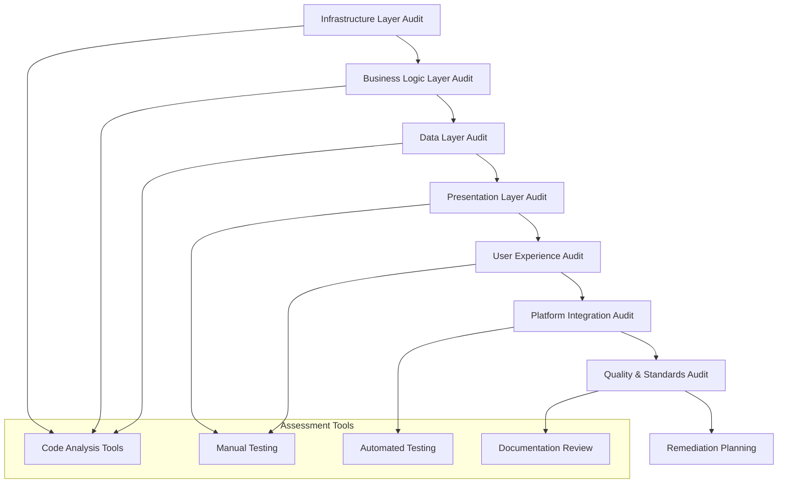

# Design Document

## Overview

This design document outlines the comprehensive approach for conducting a functionality audit of the Eunio Health App. The audit will systematically evaluate the current state of implementation across all layers of the application architecture, from infrastructure and business logic to user interface and user experience. The design focuses on creating a structured, measurable assessment that provides actionable insights for remediation planning.

## Architecture

### Audit Framework Architecture

The audit follows a layered assessment approach that mirrors the application's architecture:



### Audit Methodology

The audit employs a multi-faceted approach combining:

1. **Static Code Analysis**: Automated scanning of codebase structure and dependencies
2. **Dynamic Testing**: Manual and automated testing of application functionality
3. **Architecture Review**: Assessment of design patterns and implementation completeness
4. **User Journey Analysis**: End-to-end testing of critical user workflows
5. **Cross-Platform Validation**: Verification of feature parity between iOS and Android

## Components and Interfaces

### 1. Infrastructure Assessment Component

**Purpose**: Evaluate the foundational systems that enable app functionality

**Key Interfaces**:
- Dependency Injection Analysis Interface
- Platform Integration Assessment Interface
- Build Configuration Validator Interface

**Assessment Criteria**:
- Koin initialization status and configuration
- Shared module accessibility from platform-specific code
- Service implementation completeness
- Build system functionality and output validation

### 2. Business Logic Assessment Component

**Purpose**: Verify the implementation and connectivity of core business functionality

**Key Interfaces**:
- Use Case Validation Interface
- Repository Implementation Checker Interface
- Domain Model Verification Interface

**Assessment Criteria**:
- Use Case instantiation and dependency resolution
- Repository pattern implementation completeness
- Data model validation and business rule enforcement
- Service layer connectivity and functionality

### 3. Data Layer Assessment Component

**Purpose**: Evaluate data persistence, synchronization, and management capabilities

**Key Interfaces**:
- Local Database Assessment Interface
- Remote Service Integration Interface
- Data Synchronization Validator Interface

**Assessment Criteria**:
- SQLDelight schema implementation and operations
- Firebase/Firestore service connectivity
- Data synchronization mechanisms
- Offline functionality and data persistence

### 4. Presentation Layer Assessment Component

**Purpose**: Assess UI implementation, state management, and user interaction handling

**Key Interfaces**:
- ViewModel Connectivity Checker Interface
- UI Component Functionality Interface
- Navigation Flow Validator Interface

**Assessment Criteria**:
- ViewModel instantiation and state management
- UI component functionality and interactivity
- Navigation flow completeness and error handling
- State synchronization between UI and business logic

### 5. User Experience Assessment Component

**Purpose**: Evaluate the end-to-end user experience and feature completeness

**Key Interfaces**:
- User Journey Testing Interface
- Feature Completeness Validator Interface
- Accessibility Assessment Interface

**Assessment Criteria**:
- Complete user workflow functionality
- Feature implementation percentage and quality
- Accessibility compliance and usability
- Cross-platform experience consistency

### 6. Quality Assessment Component

**Purpose**: Evaluate code quality, testing coverage, and maintainability standards

**Key Interfaces**:
- Code Quality Analyzer Interface
- Test Coverage Assessment Interface
- Documentation Validator Interface

**Assessment Criteria**:
- Code architecture and pattern adherence
- Test coverage and quality metrics
- Documentation accuracy and completeness
- Error handling and logging implementation

## Data Models

### Audit Result Data Model

```kotlin
data class AuditResult(
    val auditId: String,
    val timestamp: Instant,
    val overallScore: AuditScore,
    val layerAssessments: List<LayerAssessment>,
    val criticalIssues: List<CriticalIssue>,
    val remediationPlan: RemediationPlan
)

data class AuditScore(
    val overall: Double, // 0.0 to 10.0
    val infrastructure: Double,
    val businessLogic: Double,
    val dataLayer: Double,
    val presentation: Double,
    val userExperience: Double,
    val quality: Double
)

data class LayerAssessment(
    val layer: AuditLayer,
    val score: Double,
    val functionalityPercentage: Double,
    val issues: List<Issue>,
    val recommendations: List<Recommendation>
)

enum class AuditLayer {
    INFRASTRUCTURE,
    BUSINESS_LOGIC,
    DATA_LAYER,
    PRESENTATION,
    USER_EXPERIENCE,
    PLATFORM_INTEGRATION,
    QUALITY_STANDARDS
}

data class Issue(
    val id: String,
    val severity: IssueSeverity,
    val category: IssueCategory,
    val title: String,
    val description: String,
    val location: String,
    val impact: String,
    val estimatedEffort: EffortEstimate
)

enum class IssueSeverity {
    CRITICAL,    // Blocks core functionality
    HIGH,        // Significantly impacts user experience
    MEDIUM,      // Affects specific features
    LOW          // Minor improvements
}

enum class IssueCategory {
    DEPENDENCY_INJECTION,
    SERVICE_IMPLEMENTATION,
    DATA_PERSISTENCE,
    UI_FUNCTIONALITY,
    BUSINESS_LOGIC,
    TESTING,
    ACCESSIBILITY,
    PERFORMANCE,
    SECURITY
}

data class EffortEstimate(
    val level: EffortLevel,
    val estimatedDays: IntRange,
    val complexity: ComplexityLevel,
    val dependencies: List<String>
)

enum class EffortLevel {
    LOW,      // 1-3 days
    MEDIUM,   // 4-8 days
    HIGH      // 9+ days
}

enum class ComplexityLevel {
    SIMPLE,      // Straightforward implementation
    MODERATE,    // Some complexity, standard patterns
    COMPLEX      // High complexity, custom solutions needed
}
```

### Feature Assessment Data Model

```kotlin
data class FeatureAssessment(
    val featureName: String,
    val currentStatus: FeatureStatus,
    val functionalityPercentage: Double,
    val missingComponents: List<String>,
    val implementedComponents: List<String>,
    val userImpact: UserImpact,
    val businessValue: BusinessValue
)

enum class FeatureStatus {
    NOT_IMPLEMENTED,      // 0% - No implementation
    NON_FUNCTIONAL,       // 1-19% - Structure only, no functionality
    PARTIALLY_IMPLEMENTED, // 20-79% - Some working features
    COMPLETE              // 80-100% - Fully functional
}

data class UserImpact(
    val affectedUserJourneys: List<String>,
    val workaroundAvailable: Boolean,
    val userExperienceRating: Double // 1.0 to 5.0
)

data class BusinessValue(
    val priority: BusinessPriority,
    val revenueImpact: RevenueImpact,
    val userRetentionImpact: RetentionImpact
)

enum class BusinessPriority {
    CRITICAL,    // Core app functionality
    HIGH,        // Important features
    MEDIUM,      // Nice-to-have features
    LOW          // Future enhancements
}
```

### Remediation Plan Data Model

```kotlin
data class RemediationPlan(
    val phases: List<RemediationPhase>,
    val totalEstimatedEffort: EffortEstimate,
    val criticalPath: List<String>,
    val dependencies: Map<String, List<String>>,
    val milestones: List<Milestone>
)

data class RemediationPhase(
    val phaseNumber: Int,
    val name: String,
    val description: String,
    val tasks: List<RemediationTask>,
    val estimatedDuration: IntRange,
    val prerequisites: List<String>,
    val deliverables: List<String>
)

data class RemediationTask(
    val taskId: String,
    val title: String,
    val description: String,
    val category: IssueCategory,
    val effort: EffortEstimate,
    val priority: TaskPriority,
    val assignedIssues: List<String>
)

enum class TaskPriority {
    BLOCKER,     // Must be completed before other work
    CRITICAL,    // High priority, affects core functionality
    HIGH,        // Important for user experience
    MEDIUM,      // Standard priority
    LOW          // Can be deferred
}

data class Milestone(
    val name: String,
    val description: String,
    val targetDate: String,
    val successCriteria: List<String>,
    val deliverables: List<String>
)
```

## Error Handling

### Audit Process Error Handling

The audit system implements comprehensive error handling to ensure reliable assessment results:

1. **Code Analysis Errors**:
   - File access failures
   - Parsing errors for malformed code
   - Dependency resolution failures
   - Build configuration issues

2. **Testing Errors**:
   - Application crash during testing
   - Network connectivity issues during remote service testing
   - Platform-specific testing failures
   - Timeout errors for long-running operations

3. **Assessment Validation Errors**:
   - Inconsistent assessment results
   - Missing required assessment data
   - Invalid scoring calculations
   - Incomplete audit coverage

### Error Recovery Strategies

```kotlin
sealed class AuditError {
    data class CodeAnalysisError(
        val file: String,
        val error: String,
        val recoveryAction: String
    ) : AuditError()
    
    data class TestingError(
        val testCase: String,
        val error: String,
        val fallbackAssessment: String
    ) : AuditError()
    
    data class ValidationError(
        val component: String,
        val error: String,
        val defaultValue: String
    ) : AuditError()
}

interface ErrorRecoveryStrategy {
    fun canRecover(error: AuditError): Boolean
    fun recover(error: AuditError): AuditResult?
    fun logError(error: AuditError)
}
```

## Testing Strategy

### Audit Validation Testing

The audit system itself requires comprehensive testing to ensure accuracy and reliability:

1. **Unit Testing**:
   - Individual assessment component testing
   - Data model validation testing
   - Scoring algorithm testing
   - Error handling testing

2. **Integration Testing**:
   - End-to-end audit process testing
   - Cross-component assessment validation
   - Report generation testing
   - Remediation plan validation

3. **Validation Testing**:
   - Known-good codebase testing (positive cases)
   - Known-broken codebase testing (negative cases)
   - Edge case handling testing
   - Performance testing for large codebases

### Test Data Management

```kotlin
data class AuditTestCase(
    val name: String,
    val description: String,
    val inputCodebase: CodebaseSnapshot,
    val expectedResults: ExpectedAuditResult,
    val testType: AuditTestType
)

enum class AuditTestType {
    POSITIVE,     // Should pass audit
    NEGATIVE,     // Should fail audit with specific issues
    EDGE_CASE,    // Tests boundary conditions
    PERFORMANCE   // Tests audit performance
}

data class CodebaseSnapshot(
    val files: Map<String, String>,
    val buildConfiguration: BuildConfig,
    val dependencies: List<Dependency>,
    val platformSpecific: Map<Platform, PlatformConfig>
)
```

### Continuous Audit Integration

The audit system supports integration with CI/CD pipelines for ongoing code quality monitoring:

1. **Automated Audit Triggers**:
   - Pull request validation
   - Nightly comprehensive audits
   - Release candidate validation
   - Dependency update impact assessment

2. **Audit Result Integration**:
   - GitHub/GitLab issue creation for critical findings
   - Slack/Teams notifications for audit completion
   - Dashboard updates with trend analysis
   - Automated remediation task creation

## Implementation Phases

### Phase 1: Core Audit Infrastructure (Week 1-2)
- Implement basic audit framework
- Create data models and interfaces
- Develop code analysis components
- Set up error handling and logging

### Phase 2: Assessment Components (Week 3-4)
- Implement infrastructure assessment
- Develop business logic evaluation
- Create data layer assessment
- Build presentation layer analysis

### Phase 3: User Experience and Quality Assessment (Week 5-6)
- Implement user journey testing
- Develop accessibility assessment
- Create quality metrics evaluation
- Build cross-platform validation

### Phase 4: Reporting and Remediation Planning (Week 7-8)
- Implement comprehensive reporting
- Develop remediation plan generation
- Create effort estimation algorithms
- Build priority and dependency analysis

### Phase 5: Integration and Validation (Week 9-10)
- Integrate all assessment components
- Validate audit accuracy with test cases
- Implement CI/CD integration
- Create documentation and training materials

## Success Metrics

### Audit Accuracy Metrics
- **Assessment Accuracy**: >95% correlation with manual expert review
- **Issue Detection Rate**: >90% of critical issues identified
- **False Positive Rate**: <5% of identified issues are false positives
- **Coverage Completeness**: 100% of defined assessment areas covered

### Performance Metrics
- **Audit Completion Time**: <30 minutes for full codebase audit
- **Resource Usage**: <2GB memory, <50% CPU during audit
- **Scalability**: Support codebases up to 100,000 lines of code
- **Reliability**: <1% audit failure rate due to system errors

### Business Impact Metrics
- **Remediation Planning Accuracy**: Effort estimates within 20% of actual
- **Priority Accuracy**: >85% agreement with stakeholder priorities
- **Implementation Success**: >80% of remediation tasks completed successfully
- **Time to Resolution**: 50% reduction in time to identify and fix issues