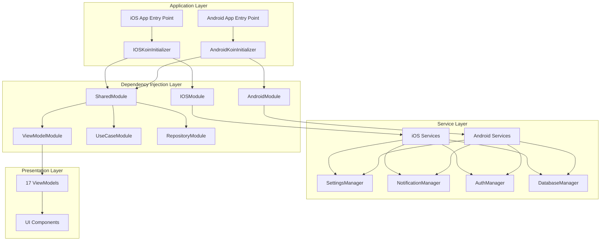

# Design Document

## Overview

This design addresses the critical infrastructure issues that are blocking 100% of application functionality. The primary issue is that while a comprehensive dependency injection architecture exists, it is not properly initialized in the application entry points, causing complete disconnection between the UI layer and business logic.

The design focuses on establishing a working dependency injection foundation through proper Koin initialization, completing ViewModel registration, and implementing essential platform services with minimal disruption to existing code.

## Architecture

### Current State Analysis

**Strengths:**
- Well-structured Koin modules already exist (SharedModule, AndroidModule, IOSModule, ViewModelModule, etc.)
- IOSKoinInitializer exists and references all required modules
- iOS app entry point calls IOSKoinInitializer.initKoin()
- Platform-specific services are architecturally defined

**Critical Issues:**
- IOSKoinInitializer.initKoin() is called but the method signature doesn't match the Swift call
- Android app has no Koin initialization at all
- 9 ViewModels are missing from ViewModelModule configuration
- Several essential services throw NotImplementedError

### Target Architecture



## Components and Interfaces

### 1. Koin Initialization Components

#### IOSKoinInitializer (Fix Required)
**Current Issue:** Method signature mismatch between Swift call and Kotlin implementation

**Current Implementation:**
```kotlin
object IOSKoinInitializer {
    fun initKoin() { ... }  // Called as doInitKoin() from Swift
}
```

**Fixed Implementation:**
```kotlin
object IOSKoinInitializer {
    fun doInitKoin() { ... }  // Matches Swift call
    
    @Deprecated("Use doInitKoin() instead")
    fun initKoin() = doInitKoin()  // Backward compatibility
}
```

#### AndroidKoinInitializer (New Component)
**Purpose:** Initialize Koin for Android platform with proper context injection

**Implementation:**
```kotlin
object AndroidKoinInitializer {
    fun initKoin(context: Context) {
        startKoin {
            androidContext(context)
            modules(
                sharedModule,
                androidModule,
                repositoryModule,
                useCaseModule,
                viewModelModule,
                unitSystemModule,
                settingsIntegrationModule
            )
        }
    }
}
```

### 2. Application Entry Points

#### Android Application Class (New Component)
**Purpose:** Initialize Koin at application startup before any activities

**Implementation:**
```kotlin
class EunioApplication : Application() {
    override fun onCreate() {
        super.onCreate()
        AndroidKoinInitializer.initKoin(this)
    }
}
```

#### MainActivity (Minimal Changes)
**Current:** No Koin initialization
**Target:** Rely on Application class for initialization, no changes needed

### 3. ViewModel Registration

#### ViewModelModule (Additions Required)
**Current:** 8 ViewModels configured (47% coverage)
**Target:** 17 ViewModels configured (100% coverage)

**Missing ViewModels to Add:**
```kotlin
// Settings ViewModels
factory { SettingsViewModel(settingsManager = get()) }
factory { EnhancedSettingsViewModel(settingsManager = get()) }

// Preferences ViewModels  
factory { DisplayPreferencesViewModel(
    getDisplayPreferencesUseCase = get(),
    updateDisplayPreferencesUseCase = get()
)}
factory { NotificationPreferencesViewModel(
    settingsManager = get(),
    notificationManager = get()
)}
factory { PrivacyPreferencesViewModel(
    settingsManager = get(),
    settingsRepository = get()
)}
factory { SyncPreferencesViewModel(
    settingsManager = get(),
    settingsRepository = get()
)}
factory { CyclePreferencesViewModel(settingsManager = get()) }
factory { UnitPreferencesViewModel(
    settingsManager = get(),
    unitConverter = get()
)}
factory { UnitSystemSettingsViewModel(unitSystemManager = get()) }
```

### 4. Essential Service Implementations

#### SettingsManager Interface (Existing)
**Current:** Interface exists, implementations throw NotImplementedError
**Target:** Functional implementations for both platforms

**Android Implementation:**
```kotlin
class AndroidSettingsManager(
    private val context: Context,
    private val settingsRepository: SettingsRepository
) : SettingsManager {
    private val sharedPrefs = context.getSharedPreferences("eunio_settings", Context.MODE_PRIVATE)
    
    override suspend fun getSetting(key: String): String? = 
        settingsRepository.getSetting(key) ?: sharedPrefs.getString(key, null)
    
    override suspend fun setSetting(key: String, value: String) {
        settingsRepository.setSetting(key, value)
        sharedPrefs.edit().putString(key, value).apply()
    }
}
```

**iOS Implementation:**
```kotlin
class IOSSettingsManager(
    private val settingsRepository: SettingsRepository
) : SettingsManager {
    override suspend fun getSetting(key: String): String? = 
        settingsRepository.getSetting(key) ?: NSUserDefaults.standardUserDefaults.stringForKey(key)
    
    override suspend fun setSetting(key: String, value: String) {
        settingsRepository.setSetting(key, value)
        NSUserDefaults.standardUserDefaults.setObject(value, forKey = key)
    }
}
```

#### NotificationManager Interface (Existing)
**Current:** Interface exists, implementations throw NotImplementedError
**Target:** Basic functional implementations

**Android Implementation:**
```kotlin
class AndroidNotificationManager(
    private val context: Context
) : NotificationManager {
    private val notificationManager = context.getSystemService(Context.NOTIFICATION_SERVICE) as NotificationManager
    
    override suspend fun scheduleNotification(notification: NotificationData) {
        // Basic implementation using AlarmManager
    }
    
    override suspend fun cancelNotification(id: String) {
        notificationManager.cancel(id.hashCode())
    }
}
```

#### AuthManager Interface (New)
**Purpose:** Centralized authentication management

**Interface:**
```kotlin
interface AuthManager {
    suspend fun signIn(email: String, password: String): Result<User>
    suspend fun signUp(email: String, password: String): Result<User>
    suspend fun signOut(): Result<Unit>
    suspend fun getCurrentUser(): User?
    suspend fun resetPassword(email: String): Result<Unit>
}
```

#### DatabaseManager (Enhancement)
**Current:** Exists but may need service interface
**Target:** Ensure proper service interface for dependency injection

## Data Models

### Service Configuration Models

#### KoinModuleConfiguration
```kotlin
data class KoinModuleConfiguration(
    val sharedModules: List<Module>,
    val platformModule: Module,
    val isInitialized: Boolean = false,
    val initializationError: String? = null
)
```

#### ServiceHealthStatus
```kotlin
data class ServiceHealthStatus(
    val serviceName: String,
    val isHealthy: Boolean,
    val lastChecked: Long,
    val errorMessage: String? = null
)
```

### Dependency Resolution Models

#### ViewModelDependencyMap
```kotlin
data class ViewModelDependencyMap(
    val viewModelClass: String,
    val dependencies: List<String>,
    val isResolvable: Boolean,
    val missingDependencies: List<String> = emptyList()
)
```

## Error Handling

### Initialization Error Handling

#### Koin Initialization Failures
**Strategy:** Graceful degradation with detailed logging

```kotlin
fun initKoinSafely(context: Context? = null): KoinInitializationResult {
    return try {
        startKoin {
            if (context != null) androidContext(context)
            modules(getAllModules())
        }
        KoinInitializationResult.Success
    } catch (e: Exception) {
        Logger.e("Koin initialization failed", e)
        KoinInitializationResult.Failure(
            error = e.message ?: "Unknown error",
            fallbackStrategy = FallbackStrategy.MANUAL_INSTANTIATION
        )
    }
}
```

#### Service Resolution Failures
**Strategy:** Service-specific fallbacks with user notification

```kotlin
inline fun <reified T> safeGet(): T? {
    return try {
        get<T>()
    } catch (e: Exception) {
        Logger.e("Failed to resolve ${T::class.simpleName}", e)
        createFallbackService<T>()
    }
}
```

### Runtime Error Handling

#### ViewModel Instantiation Failures
**Strategy:** Mock ViewModels with limited functionality

```kotlin
class ViewModelFactory {
    inline fun <reified T : ViewModel> createViewModel(): T {
        return try {
            get<T>()
        } catch (e: Exception) {
            Logger.e("Failed to create ${T::class.simpleName}", e)
            createMockViewModel<T>()
        }
    }
}
```

#### Service Operation Failures
**Strategy:** Graceful degradation with user feedback

```kotlin
abstract class BaseService {
    protected suspend fun <T> safeExecute(
        operation: suspend () -> T,
        fallback: suspend () -> T
    ): T {
        return try {
            operation()
        } catch (e: Exception) {
            Logger.e("Service operation failed", e)
            UserNotificationService.showError("Operation temporarily unavailable")
            fallback()
        }
    }
}
```

## Testing Strategy

### Unit Testing

#### Koin Module Testing
**Purpose:** Verify all dependencies can be resolved

```kotlin
class KoinModuleTest {
    @Test
    fun `all ViewModels can be instantiated`() {
        startKoin { modules(allModules) }
        
        viewModelClasses.forEach { viewModelClass ->
            assertDoesNotThrow {
                get(viewModelClass)
            }
        }
    }
    
    @Test
    fun `all services can be instantiated`() {
        startKoin { modules(allModules) }
        
        serviceInterfaces.forEach { serviceInterface ->
            assertDoesNotThrow {
                get(serviceInterface)
            }
        }
    }
}
```

#### Service Implementation Testing
**Purpose:** Verify basic service operations work

```kotlin
class SettingsManagerTest {
    @Test
    fun `can save and retrieve settings`() = runTest {
        val settingsManager = get<SettingsManager>()
        
        settingsManager.setSetting("test_key", "test_value")
        val retrieved = settingsManager.getSetting("test_key")
        
        assertEquals("test_value", retrieved)
    }
}
```

### Integration Testing

#### End-to-End DI Testing
**Purpose:** Verify complete dependency chain works

```kotlin
class EndToEndDITest {
    @Test
    fun `ViewModel can access business logic through DI`() = runTest {
        initializeKoin()
        
        val viewModel = get<OnboardingViewModel>()
        
        // Verify ViewModel can execute business operations
        assertDoesNotThrow {
            viewModel.loadUserData()
        }
    }
}
```

#### Platform-Specific Testing
**Purpose:** Verify platform services work correctly

```kotlin
class PlatformServiceTest {
    @Test
    fun `Android services integrate correctly`() {
        initializeAndroidKoin(mockContext)
        
        val settingsManager = get<SettingsManager>()
        assertTrue(settingsManager is AndroidSettingsManager)
    }
    
    @Test
    fun `iOS services integrate correctly`() {
        initializeIOSKoin()
        
        val settingsManager = get<SettingsManager>()
        assertTrue(settingsManager is IOSSettingsManager)
    }
}
```

### Validation Testing

#### Dependency Resolution Validation
**Purpose:** Ensure no circular dependencies or missing implementations

```kotlin
class DependencyValidationTest {
    @Test
    fun `no circular dependencies exist`() {
        val dependencyGraph = analyzeDependencyGraph()
        assertFalse(dependencyGraph.hasCircularDependencies())
    }
    
    @Test
    fun `all required dependencies are implemented`() {
        val missingDependencies = findMissingDependencies()
        assertTrue(missingDependencies.isEmpty())
    }
}
```

## Implementation Phases

### Phase 1: Koin Initialization (Days 1-2)
**Priority:** CRITICAL
**Goal:** Get basic DI working

1. Fix IOSKoinInitializer method signature
2. Create AndroidKoinInitializer
3. Create Android Application class
4. Test basic DI initialization on both platforms

### Phase 2: ViewModel Registration (Days 3-4)
**Priority:** HIGH
**Goal:** All ViewModels accessible through DI

1. Add missing 9 ViewModels to ViewModelModule
2. Ensure all dependencies are properly configured
3. Test ViewModel instantiation through DI
4. Verify UI can access ViewModels

### Phase 3: Essential Services (Days 5-10)
**Priority:** HIGH
**Goal:** Core services functional

1. Implement SettingsManager for both platforms
2. Implement NotificationManager for both platforms
3. Implement AuthManager interface and basic implementations
4. Ensure DatabaseManager is properly exposed as service
5. Test service operations

### Phase 4: Integration & Validation (Days 11-14)
**Priority:** MEDIUM
**Goal:** End-to-end functionality verified

1. Integration testing across all components
2. Platform-specific validation
3. Error handling verification
4. Performance impact assessment

## Risk Mitigation

### High-Risk Areas

#### Koin Configuration Complexity
**Risk:** Platform-specific configuration issues
**Mitigation:** 
- Start with minimal module configuration
- Add modules incrementally
- Extensive testing on both platforms

#### Service Implementation Dependencies
**Risk:** Circular dependencies or missing implementations
**Mitigation:**
- Implement services in dependency order
- Use interfaces for all service dependencies
- Mock implementations for complex services initially

#### iOS-Swift Integration
**Risk:** Kotlin-Swift interop issues with DI
**Mitigation:**
- Maintain existing IOSKoinInitializer pattern
- Test thoroughly on iOS Simulator and device
- Use established patterns from existing iOS ViewModels

### Backward Compatibility

#### Existing Manual Instantiations
**Strategy:** Maintain as temporary fallbacks
- Keep existing manual instantiation code
- Mark as deprecated with clear migration path
- Remove only after DI is proven stable

#### Interface Stability
**Strategy:** No breaking changes to existing interfaces
- Add new methods as extensions where possible
- Use default parameters for new functionality
- Maintain existing method signatures

## Success Metrics

### Immediate Success Criteria
- [ ] Koin initializes successfully on both iOS and Android
- [ ] All 17 ViewModels can be instantiated through DI
- [ ] ViewModels can access their required dependencies
- [ ] Basic service operations work (save/load settings, basic notifications)

### Full Success Criteria
- [ ] 100% of ViewModels connect to business logic
- [ ] All essential services provide functional implementations
- [ ] UI components can access ViewModels through DI
- [ ] No regressions in existing functionality
- [ ] Error handling works gracefully across all components