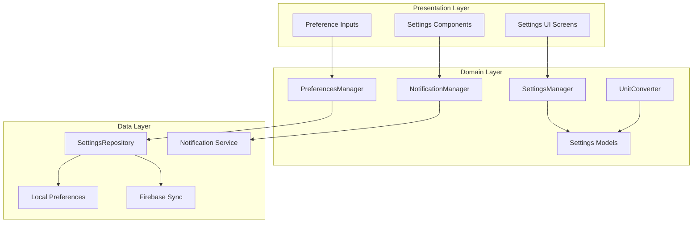

# Design Document

## Overview

The Enhanced Settings feature transforms the existing basic settings structure in the Eunio Health App into a comprehensive, functional settings system. The design follows the established clean architecture pattern with shared business logic, platform-specific UI implementations, and Firebase backend integration. The enhanced settings provide a centralized preference management system that supports real-time updates, offline-first architecture, and cross-platform synchronization.

## Architecture

### High-Level Architecture



### Integration with Existing Architecture

The enhanced settings integrate with the existing Eunio architecture by:
- Extending the User model to include comprehensive preference data
- Utilizing the existing repository pattern and dependency injection
- Following established error handling and offline-first strategies
- Integrating with Firebase Authentication and Firestore
- Maintaining consistency with the existing design system

## Components and Interfaces

### Core Domain Models

#### UserSettings Model
```kotlin
@Serializable
data class UserSettings(
    val userId: String,
    val unitPreferences: UnitPreferences,
    val notificationPreferences: NotificationPreferences,
    val cyclePreferences: CyclePreferences,
    val privacyPreferences: PrivacyPreferences,
    val displayPreferences: DisplayPreferences,
    val syncPreferences: SyncPreferences,
    val lastModified: Instant,
    val syncStatus: SyncStatus = SyncStatus.PENDING
)
```

#### UnitPreferences Model
```kotlin
@Serializable
data class UnitPreferences(
    val temperatureUnit: TemperatureUnit = TemperatureUnit.CELSIUS,
    val weightUnit: WeightUnit = WeightUnit.KILOGRAMS,
    val isManuallySet: Boolean = false
)

enum class TemperatureUnit(val displayName: String, val symbol: String) {
    CELSIUS("Celsius", "°C"),
    FAHRENHEIT("Fahrenheit", "°F")
}

enum class WeightUnit(val displayName: String, val symbol: String) {
    KILOGRAMS("Kilograms", "kg"),
    POUNDS("Pounds", "lbs")
}
```

#### NotificationPreferences Model
```kotlin
@Serializable
data class NotificationPreferences(
    val dailyLoggingReminder: NotificationSetting = NotificationSetting(),
    val periodPredictionAlert: NotificationSetting = NotificationSetting(),
    val ovulationAlert: NotificationSetting = NotificationSetting(),
    val insightNotifications: NotificationSetting = NotificationSetting(),
    val globalNotificationsEnabled: Boolean = true
)

@Serializable
data class NotificationSetting(
    val enabled: Boolean = false,
    val time: LocalTime? = null,
    val daysInAdvance: Int = 1
)
```

#### CyclePreferences Model
```kotlin
@Serializable
data class CyclePreferences(
    val averageCycleLength: Int = 28,
    val averageLutealPhaseLength: Int = 14,
    val periodDuration: Int = 5,
    val isCustomized: Boolean = false
)
```

#### PrivacyPreferences Model
```kotlin
@Serializable
data class PrivacyPreferences(
    val dataSharingEnabled: Boolean = false,
    val anonymousInsightsEnabled: Boolean = true,
    val crashReportingEnabled: Boolean = true,
    val analyticsEnabled: Boolean = true
)
```

#### DisplayPreferences Model
```kotlin
@Serializable
data class DisplayPreferences(
    val textSizeScale: Float = 1.0f,
    val highContrastMode: Boolean = false,
    val hapticFeedbackEnabled: Boolean = true,
    val hapticIntensity: HapticIntensity = HapticIntensity.MEDIUM
)

enum class HapticIntensity {
    LIGHT, MEDIUM, STRONG, DISABLED
}
```

#### SyncPreferences Model
```kotlin
@Serializable
data class SyncPreferences(
    val autoSyncEnabled: Boolean = true,
    val wifiOnlySync: Boolean = false,
    val cloudBackupEnabled: Boolean = true,
    val lastSyncTime: Instant? = null
)
```

### Settings Management System

#### SettingsManager Interface
```kotlin
interface SettingsManager {
    suspend fun getUserSettings(): Result<UserSettings>
    suspend fun updateUnitPreferences(preferences: UnitPreferences): Result<Unit>
    suspend fun updateNotificationPreferences(preferences: NotificationPreferences): Result<Unit>
    suspend fun updateCyclePreferences(preferences: CyclePreferences): Result<Unit>
    suspend fun updatePrivacyPreferences(preferences: PrivacyPreferences): Result<Unit>
    suspend fun updateDisplayPreferences(preferences: DisplayPreferences): Result<Unit>
    suspend fun updateSyncPreferences(preferences: SyncPreferences): Result<Unit>
    suspend fun resetToDefaults(): Result<Unit>
    fun observeSettingsChanges(): Flow<UserSettings>
}
```

#### SettingsManagerImpl
```kotlin
class SettingsManagerImpl(
    private val settingsRepository: SettingsRepository,
    private val notificationManager: NotificationManager,
    private val userRepository: UserRepository
) : SettingsManager {
    
    private val _settingsFlow = MutableStateFlow<UserSettings?>(null)
    
    override suspend fun getUserSettings(): Result<UserSettings> {
        return settingsRepository.getUserSettings()
            .onSuccess { settings ->
                _settingsFlow.value = settings
            }
    }
    
    override suspend fun updateUnitPreferences(preferences: UnitPreferences): Result<Unit> {
        return updateSettingsSection { currentSettings ->
            currentSettings.copy(
                unitPreferences = preferences,
                lastModified = Clock.System.now()
            )
        }
    }
    
    override suspend fun updateNotificationPreferences(preferences: NotificationPreferences): Result<Unit> {
        return updateSettingsSection { currentSettings ->
            currentSettings.copy(
                notificationPreferences = preferences,
                lastModified = Clock.System.now()
            )
        }.onSuccess {
            // Update system notifications
            notificationManager.updateNotificationSchedule(preferences)
        }
    }
    
    override suspend fun updateCyclePreferences(preferences: CyclePreferences): Result<Unit> {
        return updateSettingsSection { currentSettings ->
            currentSettings.copy(
                cyclePreferences = preferences,
                lastModified = Clock.System.now()
            )
        }.onSuccess {
            // Trigger cycle prediction recalculation
            triggerCyclePredictionUpdate(preferences)
        }
    }
    
    private suspend fun updateSettingsSection(
        update: (UserSettings) -> UserSettings
    ): Result<Unit> {
        return try {
            val currentSettings = getUserSettings().getOrThrow()
            val updatedSettings = update(currentSettings)
            
            settingsRepository.saveUserSettings(updatedSettings)
                .onSuccess { 
                    _settingsFlow.value = updatedSettings
                }
        } catch (e: Exception) {
            Result.failure(AppError.ValidationError("Failed to update settings: ${e.message}"))
        }
    }
    
    override fun observeSettingsChanges(): Flow<UserSettings> = 
        _settingsFlow.filterNotNull().asStateFlow()
}
```

### Notification Management System

#### NotificationManager Interface
```kotlin
interface NotificationManager {
    suspend fun updateNotificationSchedule(preferences: NotificationPreferences): Result<Unit>
    suspend fun scheduleNotification(type: NotificationType, setting: NotificationSetting): Result<Unit>
    suspend fun cancelNotification(type: NotificationType): Result<Unit>
    suspend fun cancelAllNotifications(): Result<Unit>
    suspend fun requestNotificationPermission(): Result<Boolean>
}
```

#### NotificationManagerImpl
```kotlin
class NotificationManagerImpl(
    private val platformNotificationService: PlatformNotificationService
) : NotificationManager {
    
    override suspend fun updateNotificationSchedule(preferences: NotificationPreferences): Result<Unit> {
        return try {
            // Cancel all existing notifications
            cancelAllNotifications()
            
            if (!preferences.globalNotificationsEnabled) {
                return Result.success(Unit)
            }
            
            // Schedule enabled notifications
            if (preferences.dailyLoggingReminder.enabled) {
                scheduleNotification(NotificationType.DAILY_LOGGING, preferences.dailyLoggingReminder)
            }
            
            if (preferences.periodPredictionAlert.enabled) {
                scheduleNotification(NotificationType.PERIOD_PREDICTION, preferences.periodPredictionAlert)
            }
            
            if (preferences.ovulationAlert.enabled) {
                scheduleNotification(NotificationType.OVULATION_ALERT, preferences.ovulationAlert)
            }
            
            if (preferences.insightNotifications.enabled) {
                scheduleNotification(NotificationType.INSIGHTS, preferences.insightNotifications)
            }
            
            Result.success(Unit)
        } catch (e: Exception) {
            Result.failure(AppError.ValidationError("Failed to update notifications: ${e.message}"))
        }
    }
    
    override suspend fun scheduleNotification(type: NotificationType, setting: NotificationSetting): Result<Unit> {
        return platformNotificationService.scheduleRepeatingNotification(
            id = type.id,
            title = type.title,
            body = type.body,
            time = setting.time ?: LocalTime(20, 0), // Default to 8 PM
            repeatInterval = RepeatInterval.DAILY
        )
    }
}
```

### Unit Conversion System

#### UnitConverter Interface
```kotlin
interface UnitConverter {
    fun convertTemperature(value: Double, from: TemperatureUnit, to: TemperatureUnit): Double
    fun convertWeight(value: Double, from: WeightUnit, to: WeightUnit): Double
    fun formatTemperature(value: Double, unit: TemperatureUnit): String
    fun formatWeight(value: Double, unit: WeightUnit): String
}
```

#### UnitConverterImpl
```kotlin
class UnitConverterImpl : UnitConverter {
    
    override fun convertTemperature(value: Double, from: TemperatureUnit, to: TemperatureUnit): Double {
        if (from == to) return value
        
        return when {
            from == TemperatureUnit.CELSIUS && to == TemperatureUnit.FAHRENHEIT -> 
                (value * 9.0 / 5.0) + 32.0
            from == TemperatureUnit.FAHRENHEIT && to == TemperatureUnit.CELSIUS -> 
                (value - 32.0) * 5.0 / 9.0
            else -> value
        }.roundToDecimalPlaces(2)
    }
    
    override fun convertWeight(value: Double, from: WeightUnit, to: WeightUnit): Double {
        if (from == to) return value
        
        return when {
            from == WeightUnit.KILOGRAMS && to == WeightUnit.POUNDS -> 
                value * 2.20462
            from == WeightUnit.POUNDS && to == WeightUnit.KILOGRAMS -> 
                value / 2.20462
            else -> value
        }.roundToDecimalPlaces(2)
    }
    
    override fun formatTemperature(value: Double, unit: TemperatureUnit): String {
        return "${value.roundToDecimalPlaces(1)}${unit.symbol}"
    }
    
    override fun formatWeight(value: Double, unit: WeightUnit): String {
        return "${value.roundToDecimalPlaces(1)} ${unit.symbol}"
    }
    
    private fun Double.roundToDecimalPlaces(places: Int): Double {
        val factor = kotlin.math.pow(10.0, places.toDouble())
        return kotlin.math.round(this * factor) / factor
    }
}
```

### Repository Layer

#### SettingsRepository Interface
```kotlin
interface SettingsRepository {
    suspend fun getUserSettings(): Result<UserSettings>
    suspend fun saveUserSettings(settings: UserSettings): Result<Unit>
    suspend fun syncSettings(): Result<Unit>
    suspend fun clearSettings(): Result<Unit>
    suspend fun exportUserData(): Result<String>
    suspend fun deleteUserData(): Result<Unit>
}
```

#### SettingsRepositoryImpl
```kotlin
class SettingsRepositoryImpl(
    private val localDataSource: SettingsLocalDataSource,
    private val remoteDataSource: SettingsRemoteDataSource,
    private val networkConnectivity: NetworkConnectivity
) : SettingsRepository {
    
    override suspend fun getUserSettings(): Result<UserSettings> {
        return try {
            // Try local first
            val localSettings = localDataSource.getSettings()
            if (localSettings != null) {
                return Result.success(localSettings)
            }
            
            // Fallback to remote if connected
            if (networkConnectivity.isConnected()) {
                val remoteSettings = remoteDataSource.getSettings().getOrNull()
                remoteSettings?.let { 
                    localDataSource.saveSettings(it) // Cache locally
                }
                Result.success(remoteSettings ?: createDefaultSettings())
            } else {
                Result.success(createDefaultSettings())
            }
        } catch (e: Exception) {
            Result.failure(AppError.DataSyncError("Failed to get settings: ${e.message}"))
        }
    }
    
    override suspend fun saveUserSettings(settings: UserSettings): Result<Unit> {
        return try {
            // Always save locally first
            localDataSource.saveSettings(settings)
            
            // Sync to remote if connected
            if (networkConnectivity.isConnected()) {
                remoteDataSource.saveSettings(settings)
                    .onSuccess { 
                        localDataSource.markAsSynced(settings.userId)
                    }
            }
            
            Result.success(Unit)
        } catch (e: Exception) {
            Result.failure(AppError.DataSyncError("Failed to save settings: ${e.message}"))
        }
    }
    
    override suspend fun exportUserData(): Result<String> {
        return try {
            val settings = getUserSettings().getOrThrow()
            val exportData = createDataExport(settings)
            Result.success(exportData)
        } catch (e: Exception) {
            Result.failure(AppError.ValidationError("Failed to export data: ${e.message}"))
        }
    }
    
    private fun createDefaultSettings(): UserSettings {
        return UserSettings(
            userId = getCurrentUserId(),
            unitPreferences = UnitPreferences(),
            notificationPreferences = NotificationPreferences(),
            cyclePreferences = CyclePreferences(),
            privacyPreferences = PrivacyPreferences(),
            displayPreferences = DisplayPreferences(),
            syncPreferences = SyncPreferences(),
            lastModified = Clock.System.now()
        )
    }
}
```

## Data Models

### Local Storage Schema

```sql
-- Settings table for comprehensive user preferences
CREATE TABLE UserSettings (
    userId TEXT PRIMARY KEY,
    unitPreferences TEXT NOT NULL, -- JSON
    notificationPreferences TEXT NOT NULL, -- JSON
    cyclePreferences TEXT NOT NULL, -- JSON
    privacyPreferences TEXT NOT NULL, -- JSON
    displayPreferences TEXT NOT NULL, -- JSON
    syncPreferences TEXT NOT NULL, -- JSON
    lastModified INTEGER NOT NULL,
    syncStatus TEXT NOT NULL DEFAULT 'PENDING',
    FOREIGN KEY (userId) REFERENCES User(id) ON DELETE CASCADE
);

-- Settings backup table for data export
CREATE TABLE SettingsBackup (
    id INTEGER PRIMARY KEY AUTOINCREMENT,
    userId TEXT NOT NULL,
    settingsData TEXT NOT NULL, -- JSON
    createdAt INTEGER NOT NULL,
    exportType TEXT NOT NULL DEFAULT 'MANUAL'
);

-- Create indexes for performance
CREATE INDEX idx_user_settings_sync_status ON UserSettings(syncStatus);
CREATE INDEX idx_settings_backup_user ON SettingsBackup(userId);
```

### Firestore Schema

```javascript
// Main user document with essential settings
users/{userId} {
    // ... existing fields
    settings: {
        unitPreferences: {
            temperatureUnit: "CELSIUS" | "FAHRENHEIT",
            weightUnit: "KILOGRAMS" | "POUNDS",
            isManuallySet: boolean
        },
        notificationPreferences: {
            globalNotificationsEnabled: boolean,
            dailyLoggingReminder: {
                enabled: boolean,
                time: string, // "HH:mm" format
                daysInAdvance: number
            },
            // ... other notification settings
        },
        cyclePreferences: {
            averageCycleLength: number,
            averageLutealPhaseLength: number,
            periodDuration: number,
            isCustomized: boolean
        },
        privacyPreferences: {
            dataSharing: boolean,
            anonymousInsights: boolean,
            crashReporting: boolean,
            analytics: boolean
        },
        displayPreferences: {
            textSizeScale: number,
            highContrastMode: boolean,
            hapticFeedbackEnabled: boolean,
            hapticIntensity: "LIGHT" | "MEDIUM" | "STRONG" | "DISABLED"
        },
        syncPreferences: {
            autoSyncEnabled: boolean,
            wifiOnlySync: boolean,
            cloudBackupEnabled: boolean,
            lastSyncTime: Timestamp
        },
        lastModified: Timestamp,
        version: number
    }
}

// Settings history for audit trail
users/{userId}/settingsHistory/{historyId} {
    settingsSnapshot: object,
    changeType: "UPDATE" | "RESET" | "EXPORT" | "DELETE",
    timestamp: Timestamp,
    deviceInfo: string
}
```

## Error Handling

### Settings-Specific Errors

```kotlin
sealed class SettingsError : AppError() {
    data class ValidationError(override val message: String) : SettingsError()
    data class SyncError(override val message: String) : SettingsError()
    data class NotificationError(override val message: String) : SettingsError()
    data class ExportError(override val message: String) : SettingsError()
}

class SettingsErrorHandler : ErrorHandler() {
    fun handleSettingsError(error: Throwable): SettingsError {
        return when (error) {
            is IllegalArgumentException -> SettingsError.ValidationError(error.message ?: "Invalid settings value")
            is SecurityException -> SettingsError.NotificationError("Notification permission denied")
            is IOException -> SettingsError.ExportError("Failed to export data")
            else -> SettingsError.SyncError(error.message ?: "Settings sync failed")
        }
    }
}
```

## Testing Strategy

### Unit Testing

#### Settings Management Tests
```kotlin
class SettingsManagerTest {
    private val mockRepository = mockk<SettingsRepository>()
    private val mockNotificationManager = mockk<NotificationManager>()
    private val manager = SettingsManagerImpl(mockRepository, mockNotificationManager, mockk())
    
    @Test
    fun `updating unit preferences saves and notifies observers`() = runTest {
        // Test implementation
    }
    
    @Test
    fun `notification preference changes update system notifications`() = runTest {
        // Test implementation
    }
}
```

#### Unit Conversion Tests
```kotlin
class UnitConverterTest {
    private val converter = UnitConverterImpl()
    
    @Test
    fun `temperature conversion celsius to fahrenheit`() {
        val result = converter.convertTemperature(0.0, TemperatureUnit.CELSIUS, TemperatureUnit.FAHRENHEIT)
        assertEquals(32.0, result, 0.01)
    }
    
    @Test
    fun `weight conversion kg to pounds`() {
        val result = converter.convertWeight(1.0, WeightUnit.KILOGRAMS, WeightUnit.POUNDS)
        assertEquals(2.20, result, 0.01)
    }
}
```

### Integration Testing

#### End-to-End Settings Flow
```kotlin
class SettingsIntegrationTest {
    @Test
    fun `changing settings updates UI and persists across app restarts`() {
        // Test complete settings flow
    }
    
    @Test
    fun `offline settings changes sync when connectivity restored`() {
        // Test offline behavior
    }
}
```

## UI Components

### Settings Screen Components

#### Main Settings Screen
```kotlin
@Composable
fun EnhancedSettingsScreen(
    viewModel: SettingsViewModel,
    onNavigateToSubSetting: (SettingType) -> Unit,
    modifier: Modifier = Modifier
) {
    val settings by viewModel.settings.collectAsState()
    val searchQuery by viewModel.searchQuery.collectAsState()
    
    Column(modifier = modifier) {
        // Search bar
        SettingsSearchBar(
            query = searchQuery,
            onQueryChange = viewModel::updateSearchQuery,
            modifier = Modifier.fillMaxWidth()
        )
        
        LazyColumn {
            // User Profile Section
            item {
                UserProfileSection(
                    user = settings.user,
                    onEditProfile = { onNavigateToSubSetting(SettingType.PROFILE) }
                )
            }
            
            // Health Settings
            item {
                SettingsSection(
                    title = "Health Settings",
                    items = listOf(
                        SettingItem(
                            icon = Icons.Default.Straighten,
                            title = "Units",
                            subtitle = "Temperature, weight units",
                            onClick = { onNavigateToSubSetting(SettingType.UNITS) }
                        ),
                        SettingItem(
                            icon = Icons.Default.Notifications,
                            title = "Notifications",
                            subtitle = "Reminders and alerts",
                            onClick = { onNavigateToSubSetting(SettingType.NOTIFICATIONS) }
                        ),
                        SettingItem(
                            icon = Icons.Default.CalendarMonth,
                            title = "Cycle Settings",
                            subtitle = "Cycle length, period duration",
                            onClick = { onNavigateToSubSetting(SettingType.CYCLE) }
                        )
                    )
                )
            }
            
            // Privacy & Security Section
            item {
                SettingsSection(
                    title = "Privacy & Security",
                    items = listOf(
                        SettingItem(
                            icon = Icons.Default.Security,
                            title = "Privacy",
                            subtitle = "Data protection settings",
                            onClick = { onNavigateToSubSetting(SettingType.PRIVACY) }
                        ),
                        SettingItem(
                            icon = Icons.Default.CloudSync,
                            title = "Data Sync",
                            subtitle = "Cloud backup and sync",
                            onClick = { onNavigateToSubSetting(SettingType.SYNC) }
                        )
                    )
                )
            }
        }
    }
}
```

#### Unit Preferences Screen
```kotlin
@Composable
fun UnitPreferencesScreen(
    preferences: UnitPreferences,
    onPreferencesChange: (UnitPreferences) -> Unit,
    modifier: Modifier = Modifier
) {
    Column(modifier = modifier.padding(16.dp)) {
        // Temperature Unit Selection
        PreferenceSection(
            title = "Temperature",
            subtitle = "Choose your preferred temperature unit"
        ) {
            Row(
                modifier = Modifier.fillMaxWidth(),
                horizontalArrangement = Arrangement.spacedBy(16.dp)
            ) {
                UnitOption(
                    unit = TemperatureUnit.CELSIUS,
                    isSelected = preferences.temperatureUnit == TemperatureUnit.CELSIUS,
                    onSelected = { 
                        onPreferencesChange(preferences.copy(temperatureUnit = it))
                    },
                    modifier = Modifier.weight(1f)
                )
                
                UnitOption(
                    unit = TemperatureUnit.FAHRENHEIT,
                    isSelected = preferences.temperatureUnit == TemperatureUnit.FAHRENHEIT,
                    onSelected = { 
                        onPreferencesChange(preferences.copy(temperatureUnit = it))
                    },
                    modifier = Modifier.weight(1f)
                )
            }
        }
        
        Spacer(modifier = Modifier.height(24.dp))
        
        // Weight Unit Selection
        PreferenceSection(
            title = "Weight",
            subtitle = "Choose your preferred weight unit"
        ) {
            Row(
                modifier = Modifier.fillMaxWidth(),
                horizontalArrangement = Arrangement.spacedBy(16.dp)
            ) {
                UnitOption(
                    unit = WeightUnit.KILOGRAMS,
                    isSelected = preferences.weightUnit == WeightUnit.KILOGRAMS,
                    onSelected = { 
                        onPreferencesChange(preferences.copy(weightUnit = it))
                    },
                    modifier = Modifier.weight(1f)
                )
                
                UnitOption(
                    unit = WeightUnit.POUNDS,
                    isSelected = preferences.weightUnit == WeightUnit.POUNDS,
                    onSelected = { 
                        onPreferencesChange(preferences.copy(weightUnit = it))
                    },
                    modifier = Modifier.weight(1f)
                )
            }
        }
    }
}
```

## Performance Considerations

### Optimization Strategies
- Settings cached in memory for immediate access
- Lazy loading of settings sections
- Debounced search queries to reduce filtering operations
- Batch settings updates to minimize database writes

### Memory Management
- Use StateFlow for reactive settings updates
- Dispose of unused ViewModels properly
- Cache frequently accessed conversion results

## Security and Privacy

### Data Protection
- Settings data encrypted at rest using platform-specific secure storage
- Sensitive preferences (like notification times) handled with extra care
- Export functionality includes user consent and data anonymization options

### Privacy Compliance
- Clear privacy controls for data sharing preferences
- Granular consent management for different data types
- Audit trail for settings changes and data exports

## Dependency Injection

### Koin Module

```kotlin
val enhancedSettingsModule = module {
    // Core Settings Components
    single<SettingsManager> { 
        SettingsManagerImpl(
            settingsRepository = get(),
            notificationManager = get(),
            userRepository = get()
        )
    }
    
    single<UnitConverter> { UnitConverterImpl() }
    
    single<NotificationManager> { 
        NotificationManagerImpl(
            platformNotificationService = get()
        )
    }
    
    // Repository
    single<SettingsRepository> {
        SettingsRepositoryImpl(
            localDataSource = get(),
            remoteDataSource = get(),
            networkConnectivity = get()
        )
    }
    
    // Data Sources
    single<SettingsLocalDataSource> { 
        SettingsLocalDataSourceImpl(get()) // DatabaseManager
    }
    single<SettingsRemoteDataSource> { 
        SettingsRemoteDataSourceImpl(get()) // FirestoreService
    }
    
    // ViewModels
    viewModel { SettingsViewModel(get()) }
    viewModel { UnitPreferencesViewModel(get()) }
    viewModel { NotificationPreferencesViewModel(get()) }
    viewModel { CyclePreferencesViewModel(get()) }
    viewModel { PrivacyPreferencesViewModel(get()) }
}
```

This design provides a comprehensive, scalable foundation for enhanced settings functionality that integrates seamlessly with the existing Eunio architecture while providing rich customization options and maintaining excellent user experience across platforms.