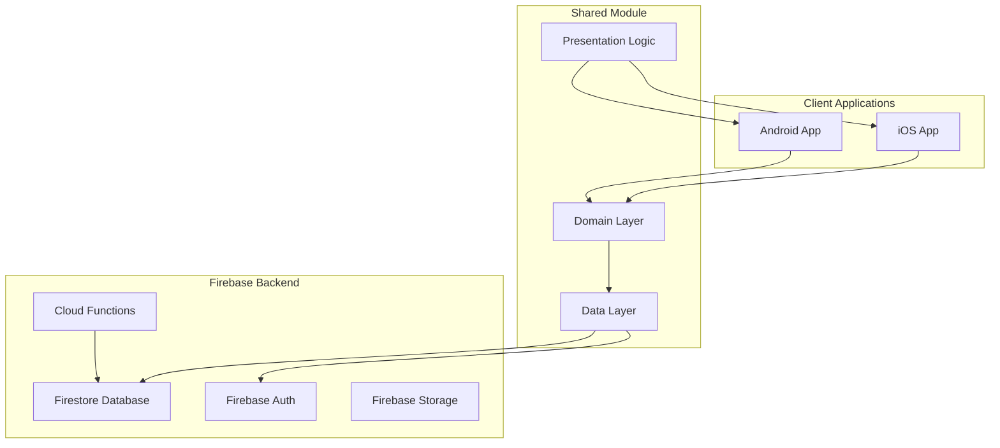

# Design Document

## Overview

Eunio is a Kotlin Multiplatform women's health tracking application that leverages Firebase Backend-as-a-Service (BaaS) to provide intelligent, personalized health insights. The architecture follows clean architecture principles with shared business logic, platform-specific UI implementations, and a serverless backend powered by Firebase Cloud Functions for advanced analytics.

## Architecture

### High-Level Architecture



### Technology Stack

- **Frontend**: Kotlin Multiplatform Mobile (KMM)
- **UI Framework**: Compose Multiplatform for shared UI components
- **Backend**: Firebase (Firestore, Authentication, Cloud Functions)
- **Local Storage**: SQLDelight for offline-first architecture
- **Networking**: Ktor client for API communication
- **Dependency Injection**: Koin
- **Date/Time**: Kotlinx-datetime
- **Serialization**: Kotlinx-serialization

## Components and Interfaces

### Shared Module Structure

```
shared/
├── src/
│   ├── commonMain/kotlin/
│   │   ├── domain/
│   │   │   ├── model/
│   │   │   │   ├── User.kt
│   │   │   │   ├── Cycle.kt
│   │   │   │   ├── DailyLog.kt
│   │   │   │   ├── Insight.kt
│   │   │   │   └── HealthReport.kt
│   │   │   ├── repository/
│   │   │   │   ├── UserRepository.kt
│   │   │   │   ├── CycleRepository.kt
│   │   │   │   ├── LogRepository.kt
│   │   │   │   └── InsightRepository.kt
│   │   │   └── usecase/
│   │   │       ├── auth/
│   │   │       ├── logging/
│   │   │       ├── cycle/
│   │   │       └── insights/
│   │   ├── data/
│   │   │   ├── remote/
│   │   │   │   ├── FirebaseAuthService.kt
│   │   │   │   ├── FirestoreService.kt
│   │   │   │   └── dto/
│   │   │   ├── local/
│   │   │   │   ├── DatabaseDriverFactory.kt
│   │   │   │   └── dao/
│   │   │   └── repository/
│   │   └── presentation/
│   │       ├── viewmodel/
│   │       └── state/
│   ├── androidMain/kotlin/
│   └── iosMain/kotlin/
```

### Core Domain Models

#### User Model
```kotlin
@Serializable
data class User(
    val id: String,
    val email: String,
    val name: String,
    val onboardingComplete: Boolean = false,
    val primaryGoal: HealthGoal,
    val createdAt: Instant,
    val updatedAt: Instant
)

enum class HealthGoal {
    CONCEPTION, CONTRACEPTION, CYCLE_TRACKING, GENERAL_HEALTH
}
```

#### Cycle Model
```kotlin
@Serializable
data class Cycle(
    val id: String,
    val userId: String,
    val startDate: LocalDate,
    val endDate: LocalDate? = null,
    val predictedOvulationDate: LocalDate? = null,
    val confirmedOvulationDate: LocalDate? = null,
    val cycleLength: Int? = null,
    val lutealPhaseLength: Int? = null
)
```

#### DailyLog Model
```kotlin
@Serializable
data class DailyLog(
    val id: String,
    val userId: String,
    val date: LocalDate,
    val periodFlow: PeriodFlow? = null,
    val symptoms: List<Symptom> = emptyList(),
    val mood: Mood? = null,
    val sexualActivity: SexualActivity? = null,
    val bbt: Double? = null,
    val cervicalMucus: CervicalMucus? = null,
    val opkResult: OPKResult? = null,
    val notes: String? = null,
    val createdAt: Instant,
    val updatedAt: Instant
)
```

#### Insight Model
```kotlin
@Serializable
data class Insight(
    val id: String,
    val userId: String,
    val generatedDate: Instant,
    val insightText: String,
    val type: InsightType,
    val isRead: Boolean = false,
    val relatedLogIds: List<String> = emptyList(),
    val confidence: Double,
    val actionable: Boolean = false
)

enum class InsightType {
    PATTERN_RECOGNITION,
    EARLY_WARNING,
    CYCLE_PREDICTION,
    FERTILITY_WINDOW
}
```

### Repository Interfaces

```kotlin
interface UserRepository {
    suspend fun getCurrentUser(): Result<User?>
    suspend fun updateUser(user: User): Result<Unit>
    suspend fun completeOnboarding(userId: String, primaryGoal: HealthGoal): Result<Unit>
}

interface CycleRepository {
    suspend fun getCurrentCycle(userId: String): Result<Cycle?>
    suspend fun getCycleHistory(userId: String, limit: Int): Result<List<Cycle>>
    suspend fun startNewCycle(userId: String, startDate: LocalDate): Result<Cycle>
    suspend fun updateCycle(cycle: Cycle): Result<Unit>
}

interface LogRepository {
    suspend fun saveDailyLog(log: DailyLog): Result<Unit>
    suspend fun getDailyLog(userId: String, date: LocalDate): Result<DailyLog?>
    suspend fun getLogsInRange(userId: String, startDate: LocalDate, endDate: LocalDate): Result<List<DailyLog>>
}

interface InsightRepository {
    suspend fun getUnreadInsights(userId: String): Result<List<Insight>>
    suspend fun markInsightAsRead(insightId: String): Result<Unit>
    suspend fun getInsightHistory(userId: String, limit: Int): Result<List<Insight>>
}
```

## Data Models

### Firestore Collections Structure

```
users/{userId}
├── email: String
├── name: String  
├── onboardingComplete: Boolean
├── primaryGoal: String
├── createdAt: Timestamp
└── updatedAt: Timestamp

users/{userId}/cycles/{cycleId}
├── startDate: Timestamp
├── endDate: Timestamp?
├── predictedOvulationDate: Timestamp?
├── confirmedOvulationDate: Timestamp?
├── cycleLength: Number?
└── lutealPhaseLength: Number?

users/{userId}/dailyLogs/{logId}
├── date: Timestamp
├── periodFlow: String?
├── symptoms: Array<String>
├── mood: String?
├── sexualActivity: Map?
├── bbt: Number?
├── cervicalMucus: String?
├── opkResult: String?
├── notes: String?
├── createdAt: Timestamp
└── updatedAt: Timestamp

users/{userId}/insights/{insightId}
├── generatedDate: Timestamp
├── insightText: String
├── type: String
├── isRead: Boolean
├── relatedLogIds: Array<String>
├── confidence: Number
└── actionable: Boolean
```

### Local Database Schema (SQLDelight)

```sql
CREATE TABLE User (
    id TEXT PRIMARY KEY,
    email TEXT NOT NULL,
    name TEXT NOT NULL,
    onboardingComplete INTEGER NOT NULL DEFAULT 0,
    primaryGoal TEXT NOT NULL,
    createdAt INTEGER NOT NULL,
    updatedAt INTEGER NOT NULL,
    syncStatus TEXT NOT NULL DEFAULT 'SYNCED'
);

CREATE TABLE DailyLog (
    id TEXT PRIMARY KEY,
    userId TEXT NOT NULL,
    date INTEGER NOT NULL,
    periodFlow TEXT,
    symptoms TEXT, -- JSON array
    mood TEXT,
    sexualActivity TEXT, -- JSON object
    bbt REAL,
    cervicalMucus TEXT,
    opkResult TEXT,
    notes TEXT,
    createdAt INTEGER NOT NULL,
    updatedAt INTEGER NOT NULL,
    syncStatus TEXT NOT NULL DEFAULT 'PENDING'
);
```

## Error Handling

### Error Types and Handling Strategy

```kotlin
sealed class AppError : Exception() {
    data class NetworkError(override val message: String) : AppError()
    data class AuthenticationError(override val message: String) : AppError()
    data class ValidationError(override val message: String) : AppError()
    data class DataSyncError(override val message: String) : AppError()
    data class UnknownError(override val message: String) : AppError()
}

class ErrorHandler {
    fun handleError(error: Throwable): AppError {
        return when (error) {
            is FirebaseAuthException -> AppError.AuthenticationError(error.message ?: "Authentication failed")
            is FirebaseFirestoreException -> AppError.NetworkError(error.message ?: "Network error")
            is IllegalArgumentException -> AppError.ValidationError(error.message ?: "Invalid input")
            else -> AppError.UnknownError(error.message ?: "Unknown error occurred")
        }
    }
}
```

### Offline-First Strategy

- All user interactions are saved locally first using SQLDelight
- Background sync service handles uploading to Firestore when connectivity is available
- Conflict resolution strategy: last-write-wins with user notification for critical conflicts
- Graceful degradation: core logging functionality works offline, insights require connectivity

## Testing Strategy

### Unit Testing
- **Domain Layer**: Test all use cases and business logic with MockK
- **Repository Layer**: Test data transformation and caching logic
- **ViewModel Layer**: Test state management and user interaction handling

### Integration Testing
- **Database Operations**: Test SQLDelight queries and migrations
- **Firebase Integration**: Test Firestore operations with Firebase Test SDK
- **Sync Logic**: Test offline/online data synchronization

### UI Testing
- **Compose UI Tests**: Test user interactions and navigation flows
- **Platform-Specific Tests**: Test native integrations on Android and iOS

### Cloud Function Testing
- **Unit Tests**: Test insight generation algorithms with sample data
- **Integration Tests**: Test Firestore triggers and data processing pipelines

### Test Data Strategy
```kotlin
object TestDataFactory {
    fun createTestUser(id: String = "test-user") = User(
        id = id,
        email = "test@example.com",
        name = "Test User",
        onboardingComplete = true,
        primaryGoal = HealthGoal.CYCLE_TRACKING,
        createdAt = Clock.System.now(),
        updatedAt = Clock.System.now()
    )
    
    fun createTestDailyLog(userId: String, date: LocalDate) = DailyLog(
        id = "test-log-${date}",
        userId = userId,
        date = date,
        periodFlow = PeriodFlow.MEDIUM,
        symptoms = listOf(Symptom.CRAMPS, Symptom.BLOATING),
        mood = Mood.NEUTRAL,
        bbt = 98.2,
        createdAt = Clock.System.now(),
        updatedAt = Clock.System.now()
    )
}
```

## Firebase Cloud Functions Architecture

### Insight Generation Function
```javascript
// Triggered daily for each user
exports.generateInsights = functions.pubsub
    .schedule('0 2 * * *') // Run at 2 AM daily
    .onRun(async (context) => {
        const users = await admin.firestore().collection('users').get();
        
        for (const userDoc of users.docs) {
            await processUserInsights(userDoc.id);
        }
    });

async function processUserInsights(userId) {
    // Fetch last 6 months of data
    // Run pattern recognition algorithms
    // Generate insights based on statistical analysis
    // Save to insights collection
}
```

### Security Rules
```javascript
rules_version = '2';
service cloud.firestore {
  match /databases/{database}/documents {
    match /users/{userId} {
      allow read, write: if request.auth != null && request.auth.uid == userId;
      
      match /dailyLogs/{logId} {
        allow read, write: if request.auth != null && request.auth.uid == userId;
      }
      
      match /insights/{insightId} {
        allow read: if request.auth != null && request.auth.uid == userId;
        allow write: if false; // Only Cloud Functions can write insights
      }
    }
  }
}
```

This design provides a robust, scalable foundation for the Eunio health tracking application with proper separation of concerns, offline-first architecture, and intelligent backend processing capabilities.