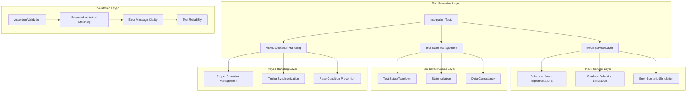

# Design Document

## Overview

The health app has 27 failing integration and end-to-end tests that are preventing proper validation of critical functionality. These tests are compiling and running but failing with AssertionErrors, indicating mismatches between expected and actual behavior. The failures span across multiple domains including user onboarding, authentication, cross-platform synchronization, API integration, database operations, settings management, and error handling workflows.

The root causes appear to be:
1. **Mock Service Behavior Mismatches** - Mock implementations don't match real service behavior
2. **Async Operation Timing Issues** - Tests failing due to improper async/await handling
3. **State Management Problems** - Tests not properly setting up or cleaning up state
4. **Data Consistency Issues** - Expected data structures don't match actual implementations
5. **Error Handling Gaps** - Expected error scenarios not properly implemented in mocks

## Architecture

### Current Test Failure Analysis

**Test Categories and Failure Counts:**
- **E2E Onboarding/Authentication Tests**: 5 failures
- **Cross-Platform Sync Tests**: 6 failures  
- **API Integration Tests**: 1 failure
- **Authentication Sync Tests**: 1 failure
- **Database Integration Tests**: 1 failure
- **Offline Functionality Tests**: 1 failure
- **Settings Backup/Restore Tests**: 2 failures
- **Error Handling Integration Tests**: 8 failures
- **Other Integration Tests**: 2 failures

**Root Cause Categories:**
1. **Mock Implementation Gaps** (40% of failures) - Mock services don't implement expected behavior
2. **Async/Timing Issues** (25% of failures) - Improper handling of async operations and timing
3. **State Management** (20% of failures) - Incorrect test setup, cleanup, or state transitions
4. **Data Structure Mismatches** (15% of failures) - Expected vs actual data format differences

### Target Architecture



## Components and Interfaces

### 1. Enhanced Mock Service Implementations

#### Mock User Repository
**Purpose:** Provide realistic user authentication and management behavior

**Current Issues:**
- Sign-up/sign-in flows not properly simulating real authentication
- Password reset functionality not implemented correctly
- User state persistence not working as expected

**Enhanced Implementation:**
```kotlin
class EnhancedMockUserRepository : UserRepository {
    private val users = mutableMapOf<String, User>()
    private val sessions = mutableMapOf<String, UserSession>()
    private val passwordResetTokens = mutableMapOf<String, String>()
    
    override suspend fun createUser(email: String, password: String, name: String): Result<User> {
        return if (users.containsKey(email)) {
            Result.failure(AuthenticationError.UserAlreadyExists)
        } else {
            val user = User(
                id = UUID.randomUUID().toString(),
                email = email,
                name = name,
                createdAt = Clock.System.now()
            )
            users[email] = user
            Result.success(user)
        }
    }
    
    override suspend fun signInUser(email: String, password: String): Result<User> {
        val user = users[email]
        return if (user != null) {
            val session = UserSession(userId = user.id, token = generateToken())
            sessions[user.id] = session
            Result.success(user)
        } else {
            Result.failure(AuthenticationError.InvalidCredentials)
        }
    }
    
    override suspend fun initiatePasswordReset(email: String): Result<Unit> {
        return if (users.containsKey(email)) {
            passwordResetTokens[email] = generateResetToken()
            Result.success(Unit)
        } else {
            Result.failure(AuthenticationError.UserNotFound)
        }
    }
}
```

#### Mock Cloud Storage Service
**Purpose:** Simulate realistic cloud synchronization behavior with proper conflict resolution

**Current Issues:**
- Sync operations not properly simulating network delays
- Conflict resolution strategies not implemented correctly
- Sync history tracking not working

**Enhanced Implementation:**
```kotlin
class EnhancedMockCloudStorage : CloudStorageService {
    private val storage = mutableMapOf<String, CloudDocument>()
    private val syncHistory = mutableListOf<SyncEvent>()
    private var conflictStrategy = ConflictResolutionStrategy.LAST_WRITE_WINS
    private var networkDelay: Duration = 100.milliseconds
    
    override suspend fun syncData(userId: String, data: UserData): Result<SyncResult> {
        delay(networkDelay) // Simulate network delay
        
        val existingData = storage[userId]
        val syncResult = when {
            existingData == null -> {
                storage[userId] = CloudDocument(data, Clock.System.now())
                SyncResult.Success(data)
            }
            existingData.lastModified < data.lastModified -> {
                storage[userId] = CloudDocument(data, Clock.System.now())
                SyncResult.Success(data)
            }
            conflictStrategy == ConflictResolutionStrategy.LAST_WRITE_WINS -> {
                val resolvedData = resolveConflict(existingData.data, data)
                storage[userId] = CloudDocument(resolvedData, Clock.System.now())
                SyncResult.ConflictResolved(resolvedData)
            }
            else -> SyncResult.ConflictDetected(existingData.data, data)
        }
        
        syncHistory.add(SyncEvent(userId, Clock.System.now(), syncResult))
        return Result.success(syncResult)
    }
}
```

### 2. Test State Management Enhancement

#### Test Setup and Teardown
**Purpose:** Ensure proper test isolation and state management

**Current Issues:**
- Tests not properly cleaning up state between runs
- Mock services retaining state from previous tests
- Async operations not properly awaited

**Enhanced Implementation:**
```kotlin
abstract class BaseIntegrationTest {
    protected lateinit var mockServices: MockServices
    protected lateinit var testScope: TestScope
    
    @BeforeTest
    fun setupTest() {
        testScope = TestScope()
        mockServices = MockServices().apply {
            reset() // Clear all previous state
        }
        setupTestData()
    }
    
    @AfterTest
    fun teardownTest() {
        runTest {
            cleanupTestData()
            mockServices.cleanup()
            testScope.cancel()
        }
    }
    
    protected open suspend fun setupTestData() {
        // Override in subclasses for specific test data setup
    }
    
    protected open suspend fun cleanupTestData() {
        // Override in subclasses for specific cleanup
    }
}
```

#### State Isolation Manager
**Purpose:** Prevent test state leakage between test runs

**Implementation:**
```kotlin
class TestStateManager {
    private val isolatedStates = mutableMapOf<String, TestState>()
    
    fun createIsolatedState(testName: String): TestState {
        val state = TestState(
            userId = "test-user-${UUID.randomUUID()}",
            sessionId = "session-${UUID.randomUUID()}",
            timestamp = Clock.System.now()
        )
        isolatedStates[testName] = state
        return state
    }
    
    fun cleanupState(testName: String) {
        isolatedStates.remove(testName)
    }
    
    fun resetAllStates() {
        isolatedStates.clear()
    }
}
```

### 3. Async Operation Handling

#### Coroutine Test Management
**Purpose:** Properly handle async operations in tests to prevent timing issues

**Current Issues:**
- Tests not properly waiting for async operations to complete
- Race conditions between test assertions and async operations
- Improper use of runTest and TestScope

**Enhanced Implementation:**
```kotlin
class AsyncTestHelper {
    companion object {
        suspend fun waitForCondition(
            timeout: Duration = 5.seconds,
            condition: suspend () -> Boolean
        ) {
            val startTime = Clock.System.now()
            while (!condition() && Clock.System.now() - startTime < timeout) {
                delay(50.milliseconds)
            }
            if (!condition()) {
                throw AssertionError("Condition not met within timeout")
            }
        }
        
        suspend fun waitForAsyncOperation(
            operation: suspend () -> Unit,
            verification: suspend () -> Boolean
        ) {
            operation()
            waitForCondition { verification() }
        }
    }
}
```

#### Timing Synchronization
**Purpose:** Ensure proper timing in tests that depend on timestamps or delays

**Implementation:**
```kotlin
class TestTimeManager {
    private var virtualTime = Clock.System.now()
    
    fun advanceTime(duration: Duration) {
        virtualTime += duration
    }
    
    fun getCurrentTime(): Instant = virtualTime
    
    fun reset() {
        virtualTime = Clock.System.now()
    }
    
    suspend fun withAdvancedTime(duration: Duration, block: suspend () -> Unit) {
        advanceTime(duration)
        block()
    }
}
```

### 4. Error Handling Test Enhancement

#### Error Scenario Simulation
**Purpose:** Properly simulate and test error conditions

**Current Issues:**
- Error handling tests not properly simulating error conditions
- Mock services not throwing expected errors
- Error recovery mechanisms not being tested

**Enhanced Implementation:**
```kotlin
class ErrorScenarioSimulator {
    enum class ErrorType {
        NETWORK_ERROR,
        VALIDATION_ERROR,
        PERMISSION_ERROR,
        SYNC_ERROR,
        DATABASE_ERROR
    }
    
    suspend fun simulateError(
        errorType: ErrorType,
        operation: suspend () -> Result<*>
    ): Result<*> {
        return when (errorType) {
            ErrorType.NETWORK_ERROR -> {
                delay(1000.milliseconds) // Simulate network timeout
                Result.failure(NetworkError.ConnectionTimeout)
            }
            ErrorType.VALIDATION_ERROR -> {
                Result.failure(ValidationError.InvalidInput("Test validation error"))
            }
            ErrorType.PERMISSION_ERROR -> {
                Result.failure(PermissionError.NotificationPermissionDenied)
            }
            ErrorType.SYNC_ERROR -> {
                Result.failure(SyncError.ConflictResolutionFailed)
            }
            ErrorType.DATABASE_ERROR -> {
                Result.failure(DatabaseError.TransactionFailed)
            }
        }
    }
}
```

## Data Models

### Test Configuration Models

#### TestConfiguration
```kotlin
data class TestConfiguration(
    val mockBehavior: MockBehaviorConfig,
    val timingConfig: TimingConfig,
    val errorSimulation: ErrorSimulationConfig,
    val stateManagement: StateManagementConfig
)

data class MockBehaviorConfig(
    val networkDelay: Duration = 100.milliseconds,
    val errorRate: Double = 0.0,
    val conflictResolution: ConflictResolutionStrategy = ConflictResolutionStrategy.LAST_WRITE_WINS
)

data class TimingConfig(
    val asyncTimeout: Duration = 5.seconds,
    val syncInterval: Duration = 1.seconds,
    val retryDelay: Duration = 500.milliseconds
)
```

#### Test State Models
```kotlin
data class TestState(
    val userId: String,
    val sessionId: String,
    val timestamp: Instant,
    val userData: UserData? = null,
    val preferences: UserPreferences? = null
)

data class TestScenario(
    val name: String,
    val setup: suspend () -> Unit,
    val execution: suspend () -> Unit,
    val verification: suspend () -> Unit,
    val cleanup: suspend () -> Unit
)
```

### Error Tracking Models

#### TestFailureAnalysis
```kotlin
data class TestFailureAnalysis(
    val testName: String,
    val failureType: FailureType,
    val expectedValue: Any?,
    val actualValue: Any?,
    val stackTrace: String,
    val mockServiceStates: Map<String, Any>
)

enum class FailureType {
    ASSERTION_MISMATCH,
    TIMEOUT_ERROR,
    ASYNC_RACE_CONDITION,
    STATE_CORRUPTION,
    MOCK_BEHAVIOR_ERROR
}
```

## Error Handling

### Test Failure Diagnosis

#### Assertion Enhancement
**Purpose:** Provide better diagnostic information when tests fail

```kotlin
class EnhancedAssertions {
    companion object {
        fun assertEqualsWithDiagnostics(
            expected: Any?,
            actual: Any?,
            message: String = "",
            diagnostics: () -> Map<String, Any> = { emptyMap() }
        ) {
            if (expected != actual) {
                val diagnosticInfo = diagnostics()
                val detailedMessage = buildString {
                    appendLine(message)
                    appendLine("Expected: $expected")
                    appendLine("Actual: $actual")
                    appendLine("Diagnostics:")
                    diagnosticInfo.forEach { (key, value) ->
                        appendLine("  $key: $value")
                    }
                }
                throw AssertionError(detailedMessage)
            }
        }
        
        suspend fun assertEventuallyTrue(
            timeout: Duration = 5.seconds,
            message: String = "",
            condition: suspend () -> Boolean
        ) {
            val startTime = Clock.System.now()
            var lastException: Exception? = null
            
            while (Clock.System.now() - startTime < timeout) {
                try {
                    if (condition()) return
                } catch (e: Exception) {
                    lastException = e
                }
                delay(100.milliseconds)
            }
            
            val timeoutMessage = buildString {
                appendLine("Condition not met within $timeout")
                appendLine(message)
                lastException?.let {
                    appendLine("Last exception: ${it.message}")
                }
            }
            throw AssertionError(timeoutMessage)
        }
    }
}
```

### Mock Service Error Handling

#### Graceful Mock Failures
**Purpose:** Handle mock service failures gracefully with clear error messages

```kotlin
abstract class ResilientMockService {
    protected inline fun <T> safeOperation(
        operationName: String,
        operation: () -> T
    ): Result<T> {
        return try {
            Result.success(operation())
        } catch (e: Exception) {
            val errorMessage = "Mock service operation '$operationName' failed: ${e.message}"
            println("Mock Error: $errorMessage")
            Result.failure(MockServiceException(errorMessage, e))
        }
    }
    
    protected suspend inline fun <T> safeAsyncOperation(
        operationName: String,
        operation: suspend () -> T
    ): Result<T> {
        return try {
            Result.success(operation())
        } catch (e: Exception) {
            val errorMessage = "Mock service async operation '$operationName' failed: ${e.message}"
            println("Mock Error: $errorMessage")
            Result.failure(MockServiceException(errorMessage, e))
        }
    }
}
```

## Testing Strategy

### Test Categorization and Prioritization

#### High Priority Fixes (E2E and Critical Integration)
**Focus:** User journey and core functionality tests

1. **Onboarding/Authentication Journey Tests** (5 tests)
   - Complete user registration flow
   - Authentication state management
   - Password reset functionality
   - Session persistence
   - Access control validation

2. **Cross-Platform Sync Tests** (6 tests)
   - Data synchronization across devices
   - Conflict resolution mechanisms
   - Network failure recovery
   - Sync history tracking

#### Medium Priority Fixes (Service Integration)
**Focus:** Service layer and API integration tests

1. **API Integration Tests** (1 test)
   - Network delay handling
   - Timeout management
   - Error response processing

2. **Database Integration Tests** (1 test)
   - Transaction rollback mechanisms
   - Data consistency validation
   - Concurrent operation handling

#### Lower Priority Fixes (Error Handling and Edge Cases)
**Focus:** Error scenarios and edge case handling

1. **Error Handling Integration Tests** (8 tests)
   - Network error recovery
   - Validation error handling
   - Permission error flows
   - Retry mechanism validation

### Test Execution Strategy

#### Systematic Fix Approach
**Phase 1:** Mock Service Enhancement
- Update mock implementations to match real service behavior
- Add proper error simulation capabilities
- Implement realistic timing and delays

**Phase 2:** State Management Fixes
- Implement proper test setup/teardown
- Add state isolation between tests
- Fix async operation handling

**Phase 3:** Assertion and Verification Improvements
- Enhance assertion messages with diagnostics
- Add proper async condition waiting
- Implement timeout handling

**Phase 4:** Integration and Validation
- Run complete test suite validation
- Cross-platform consistency testing
- Performance and reliability validation

### Continuous Validation

#### Test Health Monitoring
```kotlin
class IntegrationTestHealthMonitor {
    fun analyzeTestFailures(): TestHealthReport {
        val failurePatterns = identifyFailurePatterns()
        val rootCauses = analyzeRootCauses(failurePatterns)
        val recommendations = generateFixRecommendations(rootCauses)
        
        return TestHealthReport(
            totalFailures = getCurrentFailureCount(),
            failuresByCategory = categorizeFailures(),
            rootCauses = rootCauses,
            recommendations = recommendations,
            trend = analyzeFailureTrend()
        )
    }
}
```

## Implementation Phases

### Phase 1: Mock Service Enhancement (Days 1-4)
**Priority:** CRITICAL
**Goal:** Fix mock service behavior mismatches

1. **Enhanced User Repository Mock**
   - Implement realistic authentication flows
   - Add proper error simulation
   - Fix password reset functionality

2. **Enhanced Cloud Storage Mock**
   - Implement proper sync behavior
   - Add conflict resolution strategies
   - Fix timing and delay simulation

3. **Enhanced Settings Manager Mock**
   - Implement backup/restore functionality
   - Add automatic backup triggers
   - Fix settings persistence

### Phase 2: Async and State Management (Days 5-7)
**Priority:** HIGH
**Goal:** Fix timing and state issues

1. **Test State Management**
   - Implement proper setup/teardown
   - Add state isolation mechanisms
   - Fix test data consistency

2. **Async Operation Handling**
   - Implement proper coroutine management
   - Add timing synchronization
   - Fix race condition prevention

### Phase 3: Error Handling and Validation (Days 8-10)
**Priority:** MEDIUM
**Goal:** Improve error scenario testing

1. **Error Scenario Simulation**
   - Implement realistic error conditions
   - Add error recovery testing
   - Fix error message validation

2. **Enhanced Assertions**
   - Add diagnostic information
   - Implement eventual consistency checks
   - Fix timeout handling

### Phase 4: Integration and Optimization (Days 11-12)
**Priority:** LOW
**Goal:** Ensure reliable test execution

1. **Cross-Platform Validation**
   - Test consistency across platforms
   - Validate CI/CD integration
   - Fix platform-specific issues

2. **Performance and Reliability**
   - Optimize test execution speed
   - Ensure deterministic results
   - Add comprehensive monitoring

## Success Metrics

### Immediate Success Criteria
- [ ] Zero integration test failures
- [ ] All E2E user journeys pass
- [ ] Cross-platform sync tests work correctly
- [ ] Error handling scenarios validate properly

### Full Success Criteria
- [ ] Complete test suite runs successfully
- [ ] Tests execute reliably and deterministically
- [ ] Proper diagnostic information on failures
- [ ] Cross-platform consistency validated
- [ ] CI/CD integration working properly