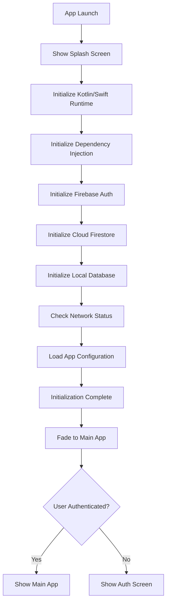
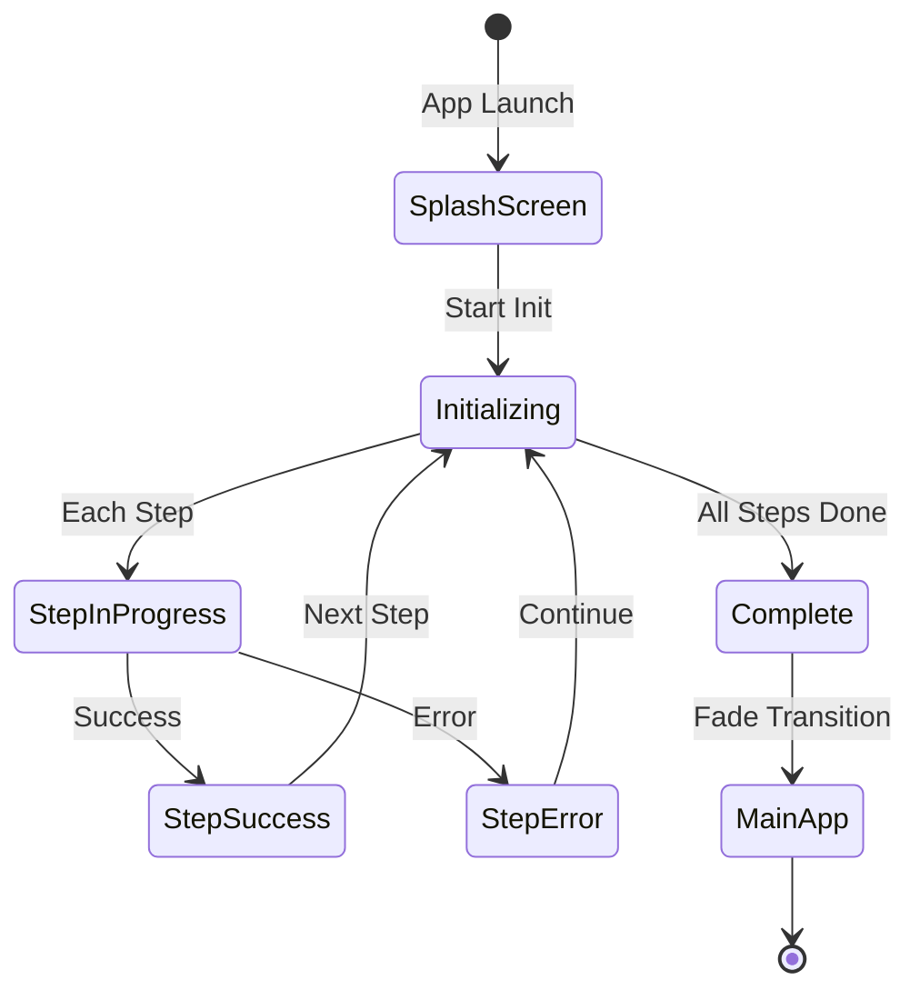
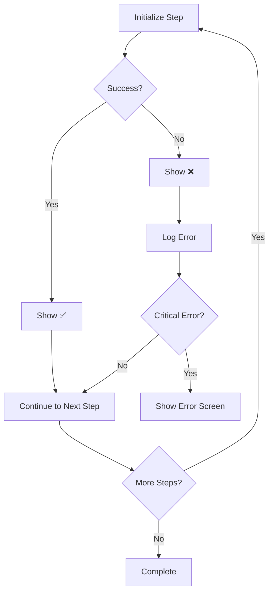

# Splash Screen Flow Diagram

## App Launch Flow



## State Transitions



## Component Architecture

```
┌─────────────────────────────────────────┐
│           MainActivity (Android)        │
│           iOSApp (iOS)                  │
├─────────────────────────────────────────┤
│                                         │
│  ┌───────────────────────────────────┐  │
│  │      Splash Screen Component      │  │
│  ├───────────────────────────────────┤  │
│  │                                   │  │
│  │  • Animated Background            │  │
│  │  • Logo Display                   │  │
│  │  • Initialization Log             │  │
│  │  • Status Indicators              │  │
│  │  • Version Info                   │  │
│  │                                   │  │
│  └───────────────────────────────────┘  │
│              ↓                          │
│  ┌───────────────────────────────────┐  │
│  │   Initialization Logic            │  │
│  ├───────────────────────────────────┤  │
│  │                                   │  │
│  │  1. Runtime Check                 │  │
│  │  2. Koin Init                     │  │
│  │  3. Firebase Auth                 │  │
│  │  4. Firestore                     │  │
│  │  5. Database                      │  │
│  │  6. Network                       │  │
│  │  7. Configuration                 │  │
│  │                                   │  │
│  └───────────────────────────────────┘  │
│              ↓                          │
│  ┌───────────────────────────────────┐  │
│  │      Main App Flow                │  │
│  ├───────────────────────────────────┤  │
│  │                                   │  │
│  │  • Onboarding                     │  │
│  │  • Authentication                 │  │
│  │  • Main App                       │  │
│  │                                   │  │
│  └───────────────────────────────────┘  │
│                                         │
└─────────────────────────────────────────┘
```

## Timing Diagram

```
Time (ms)    Event
─────────────────────────────────────────────
0            App Launch
             │
100          Splash Screen Appears
             │ ┌─ Logo Animation
             │ └─ Gradient Animation Starts
             │
300          Kotlin/Swift Runtime Check
             │ ├─ Show Spinner
             │ └─ Check Complete ✅
             │
600          Dependency Injection Init
             │ ├─ Show Spinner
             │ └─ Koin Ready ✅
             │
1000         Firebase Auth Check
             │ ├─ Show Spinner
             │ └─ Auth Status ✅
             │
1300         Cloud Firestore Init
             │ ├─ Show Spinner
             │ └─ Firestore Ready ✅
             │
1600         Local Database Check
             │ ├─ Show Spinner
             │ └─ Database Ready ✅
             │
1900         Network Status Check
             │ ├─ Show Spinner
             │ └─ Network OK ✅
             │
2100         App Configuration Load
             │ ├─ Show Spinner
             │ └─ Config Loaded ✅
             │
2300         "Initialization Complete"
             │
2800         Begin Fade Transition
             │
3300         Main App Visible
             │
─────────────────────────────────────────────
```

## Data Flow

```
┌──────────────┐
│  App Launch  │
└──────┬───────┘
       │
       ▼
┌──────────────────────┐
│  Splash Screen       │
│  State: showSplash   │
│  = true              │
└──────┬───────────────┘
       │
       ▼
┌──────────────────────┐
│  Initialize Steps    │
│  ┌────────────────┐  │
│  │ Step 1: ⏳     │  │
│  │ Step 2: ⏳     │  │
│  │ Step 3: ⏳     │  │
│  └────────────────┘  │
└──────┬───────────────┘
       │
       ▼
┌──────────────────────┐
│  Execute Step 1      │
│  Status: 🔄          │
└──────┬───────────────┘
       │
       ▼
┌──────────────────────┐
│  Step 1 Complete     │
│  Status: ✅          │
│  Message: "v2.2.20"  │
└──────┬───────────────┘
       │
       ▼
┌──────────────────────┐
│  Execute Step 2...   │
│  (Repeat for all)    │
└──────┬───────────────┘
       │
       ▼
┌──────────────────────┐
│  All Steps Complete  │
│  ┌────────────────┐  │
│  │ Step 1: ✅     │  │
│  │ Step 2: ✅     │  │
│  │ Step 3: ✅     │  │
│  └────────────────┘  │
└──────┬───────────────┘
       │
       ▼
┌──────────────────────┐
│  Update State        │
│  showSplash = false  │
└──────┬───────────────┘
       │
       ▼
┌──────────────────────┐
│  Show Main App       │
└──────────────────────┘
```

## Error Handling Flow



## Platform-Specific Implementation

### Android (Compose)

```
MainActivity
    └─ EunioTheme
        └─ Surface
            └─ if (showSplash)
                └─ SplashScreen(
                    onInitComplete = {
                        showSplash = false
                    }
                )
            └─ else
                └─ OnboardingFlow()
```

### iOS (SwiftUI)

```
iOSApp
    └─ WindowGroup
        └─ ZStack
            └─ if showSplash
                └─ SplashView(
                    onInitComplete: {
                        showSplash = false
                    }
                )
            └─ else
                └─ ContentView()
```

## Initialization Steps Detail

```
┌─────────────────────────────────────────┐
│ Step 1: Kotlin/Swift Runtime            │
├─────────────────────────────────────────┤
│ • Check runtime version                 │
│ • Verify environment                    │
│ • Duration: ~300ms                      │
│ • Critical: Yes                         │
└─────────────────────────────────────────┘

┌─────────────────────────────────────────┐
│ Step 2: Dependency Injection            │
├─────────────────────────────────────────┤
│ • Initialize Koin                       │
│ • Load modules                          │
│ • Duration: ~400ms                      │
│ • Critical: Yes                         │
└─────────────────────────────────────────┘

┌─────────────────────────────────────────┐
│ Step 3: Firebase Authentication         │
├─────────────────────────────────────────┤
│ • Check Firebase connection             │
│ • Verify current user                   │
│ • Duration: ~300ms                      │
│ • Critical: No (can work offline)      │
└─────────────────────────────────────────┘

┌─────────────────────────────────────────┐
│ Step 4: Cloud Firestore                │
├─────────────────────────────────────────┤
│ • Initialize Firestore                  │
│ • Check persistence settings            │
│ • Duration: ~300ms                      │
│ • Critical: No (can work offline)      │
└─────────────────────────────────────────┘

┌─────────────────────────────────────────┐
│ Step 5: Local Database                 │
├─────────────────────────────────────────┤
│ • Initialize SQLDelight                 │
│ • Verify database access                │
│ • Duration: ~300ms                      │
│ • Critical: Yes                         │
└─────────────────────────────────────────┘

┌─────────────────────────────────────────┐
│ Step 6: Network Status                 │
├─────────────────────────────────────────┤
│ • Check connectivity                    │
│ • Verify internet access                │
│ • Duration: ~200ms                      │
│ • Critical: No                          │
└─────────────────────────────────────────┘

┌─────────────────────────────────────────┐
│ Step 7: App Configuration              │
├─────────────────────────────────────────┤
│ • Load settings                         │
│ • Initialize preferences                │
│ • Duration: ~200ms                      │
│ • Critical: Yes                         │
└─────────────────────────────────────────┘
```

## Visual State Machine

```
┌─────────────┐
│   INITIAL   │
│  (Hidden)   │
└──────┬──────┘
       │ App Launch
       ▼
┌─────────────┐
│   SHOWING   │
│  (Visible)  │
└──────┬──────┘
       │ Start Init
       ▼
┌─────────────┐
│ INITIALIZING│
│  (Active)   │
└──────┬──────┘
       │ Steps Execute
       ▼
┌─────────────┐
│  COMPLETE   │
│  (Success)  │
└──────┬──────┘
       │ Fade Out
       ▼
┌─────────────┐
│   HIDDEN    │
│  (Done)     │
└─────────────┘
```

---

This diagram shows the complete flow of the splash screen from app launch to main app display.
