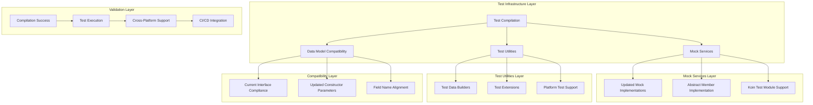

# Design Document

## Overview

The test infrastructure is completely broken with 376 compilation errors across multiple categories. The main issues are outdated mock implementations, interface mismatches, missing dependencies, and data model incompatibilities. This design provides a systematic approach to fix all test compilation issues and establish a robust testing foundation.

## Architecture

### Current State Analysis

**Error Breakdown:**
- **177 errors** - Type mismatches and parameter issues (47%)
- **113 errors** - Unresolved references (30%) 
- **14 errors** - Abstract class implementation issues (4%)
- **72 errors** - Other compilation issues (19%)

**Root Causes:**
1. **Outdated Mock Implementations** - Mock classes don't implement current interface methods
2. **Data Model Evolution** - Test models use old constructor parameters and field names
3. **Missing Dependencies** - Unresolved imports and missing test utilities
4. **Interface Changes** - Method signatures have evolved but tests haven't been updated

### Target Architecture



## Components and Interfaces

### 1. Mock Service Modernization

#### Updated Mock Implementations
**Purpose:** Bring all mock classes up to date with current interfaces

**Strategy:**
```kotlin
// Before (Broken)
class MockPreferencesLocalDataSource : PreferencesLocalDataSource {
    // Missing getPreferences() method
    override suspend fun savePreferences(preferences: UserPreferences): Result<Unit> = Result.success(Unit)
}

// After (Fixed)
class MockPreferencesLocalDataSource : PreferencesLocalDataSource {
    private var storedPreferences: UserPreferences? = null
    
    override suspend fun getPreferences(): UserPreferences? = storedPreferences
    override suspend fun savePreferences(preferences: UserPreferences): Result<Unit> {
        storedPreferences = preferences
        return Result.success(Unit)
    }
    override suspend fun markAsSynced(userId: String): Result<Unit> = Result.success(Unit)
    override suspend fun markAsFailed(userId: String): Result<Unit> = Result.success(Unit)
}
```

#### Abstract Member Implementation
**Purpose:** Ensure all abstract classes are properly implemented

**Implementation Pattern:**
```kotlin
abstract class BaseTestClass {
    abstract suspend fun hasStableConnection(): Boolean
}

// Fixed Implementation
class MockNetworkConnectivity : NetworkConnectivity {
    var isStable: Boolean = true
    
    override suspend fun hasStableConnection(): Boolean = isStable
    override suspend fun isConnected(): Boolean = true
    override suspend fun getConnectionType(): ConnectionType = ConnectionType.WIFI
}
```

### 2. Data Model Compatibility

#### Constructor Parameter Updates
**Purpose:** Align test data models with current constructors

**Current Issues:**
- Tests use old parameter names (theme, language, dateFormat)
- Missing required parameters (generatedDate, type)
- Incorrect parameter types

**Solution Pattern:**
```kotlin
// Before (Broken)
val testPreferences = DisplayPreferences(
    theme = "dark",
    language = "en", 
    dateFormat = "MM/dd/yyyy"
)

// After (Fixed)
val testPreferences = DisplayPreferences(
    userId = "test-user",
    displaySettings = DisplaySettings(
        theme = ThemeType.DARK,
        language = LanguageCode.EN,
        dateFormat = DateFormat.US
    ),
    generatedDate = Clock.System.now(),
    type = PreferenceType.DISPLAY
)
```

#### Field Name Alignment
**Purpose:** Update field access to match current model structure

**Implementation:**
```kotlin
// Create test data builders for consistent model creation
class TestDataBuilder {
    fun createUserPreferences(
        userId: String = "test-user",
        displaySettings: DisplaySettings = createDefaultDisplaySettings(),
        notificationSettings: NotificationSettings = createDefaultNotificationSettings()
    ): UserPreferences {
        return UserPreferences(
            userId = userId,
            displaySettings = displaySettings,
            notificationSettings = notificationSettings,
            lastModified = Clock.System.now()
        )
    }
}
```

### 3. Dependency Resolution

#### Missing Import Resolution
**Purpose:** Fix all unresolved reference errors

**Categories:**
1. **Platform Managers** - HapticFeedbackManager, ThemeManager
2. **Enum Values** - IRRITATED, FERTILITY_TRACKING, etc.
3. **Test Framework** - KoinTest, test annotations
4. **Data Classes** - ServerError, SettingsHistoryEntry

**Resolution Strategy:**
```kotlin
// Add missing imports
import com.eunio.healthapp.platform.haptic.HapticFeedbackManager
import com.eunio.healthapp.platform.theme.ThemeManager
import com.eunio.healthapp.domain.model.HealthGoal
import org.koin.test.KoinTest
import kotlin.test.Test
```

#### Test Framework Dependencies
**Purpose:** Ensure proper test framework setup

**Implementation:**
```kotlin
// Base test class with proper setup
abstract class BaseKoinTest : KoinTest {
    
    @BeforeTest
    fun setup() {
        startKoin {
            modules(testModule)
        }
    }
    
    @AfterTest
    fun teardown() {
        stopKoin()
    }
}

val testModule = module {
    // Mock implementations for testing
    single<NetworkConnectivity> { MockNetworkConnectivity() }
    single<HapticFeedbackManager> { MockHapticFeedbackManager() }
    single<ThemeManager> { MockThemeManager() }
}
```

### 4. Platform-Specific Test Support

#### Android Test Context
**Purpose:** Provide proper Android context for tests

**Implementation:**
```kotlin
class AndroidTestContext {
    companion object {
        fun createMockContext(): Context {
            return mockk<Context> {
                every { getSharedPreferences(any(), any()) } returns mockk()
                every { cacheDir } returns File("/tmp/test-cache")
            }
        }
    }
}
```

#### iOS Test Support
**Purpose:** Ensure iOS-specific tests work in CI/CD

**Implementation:**
```kotlin
class IOSTestSupport {
    companion object {
        fun setupIOSTestEnvironment() {
            // Configure iOS-specific test environment
            // Mock NSUserDefaults, UIViewController, etc.
        }
    }
}
```

## Data Models

### Test Configuration Models

#### TestModuleConfiguration
```kotlin
data class TestModuleConfiguration(
    val mockServices: List<MockService>,
    val testData: TestDataSet,
    val platformConfig: PlatformTestConfig
)

sealed class MockService {
    object NetworkConnectivity : MockService()
    object HapticFeedback : MockService()
    object ThemeManager : MockService()
    data class Custom(val serviceClass: KClass<*>) : MockService()
}
```

#### TestDataSet
```kotlin
data class TestDataSet(
    val users: List<TestUser>,
    val preferences: List<TestPreferences>,
    val healthData: List<TestHealthData>
)

data class TestUser(
    val id: String = "test-user-${UUID.randomUUID()}",
    val email: String = "test@example.com",
    val profile: UserProfile = createDefaultProfile()
)
```

### Error Tracking Models

#### CompilationErrorSummary
```kotlin
data class CompilationErrorSummary(
    val totalErrors: Int,
    val errorsByCategory: Map<ErrorCategory, Int>,
    val errorsByFile: Map<String, List<CompilationError>>
)

enum class ErrorCategory {
    UNRESOLVED_REFERENCE,
    TYPE_MISMATCH,
    ABSTRACT_IMPLEMENTATION,
    PARAMETER_MISMATCH,
    OTHER
}
```

## Error Handling

### Compilation Error Resolution

#### Systematic Error Fixing
**Strategy:** Fix errors in order of impact and dependency

```kotlin
class TestFixingStrategy {
    fun getFixingOrder(): List<FixingPhase> = listOf(
        FixingPhase.IMPORTS_AND_REFERENCES,
        FixingPhase.ABSTRACT_IMPLEMENTATIONS, 
        FixingPhase.DATA_MODEL_COMPATIBILITY,
        FixingPhase.TYPE_MISMATCHES,
        FixingPhase.PLATFORM_SPECIFIC_ISSUES
    )
}

enum class FixingPhase {
    IMPORTS_AND_REFERENCES,      // Fix unresolved references first
    ABSTRACT_IMPLEMENTATIONS,    // Implement missing abstract members
    DATA_MODEL_COMPATIBILITY,    // Update data model usage
    TYPE_MISMATCHES,            // Fix type compatibility issues
    PLATFORM_SPECIFIC_ISSUES    // Address platform-specific problems
}
```

#### Error Recovery Patterns
**Purpose:** Provide fallback mechanisms for test failures

```kotlin
abstract class ResilientTest {
    protected inline fun <T> safeTestExecution(
        testName: String,
        test: () -> T
    ): T? {
        return try {
            test()
        } catch (e: Exception) {
            println("Test '$testName' failed: ${e.message}")
            null
        }
    }
}
```

### Runtime Error Handling

#### Mock Service Failures
**Strategy:** Graceful degradation with clear error messages

```kotlin
class MockServiceManager {
    fun <T> createMockService(serviceClass: KClass<T>): T {
        return try {
            createMockImplementation(serviceClass)
        } catch (e: Exception) {
            throw MockCreationException(
                "Failed to create mock for ${serviceClass.simpleName}: ${e.message}",
                serviceClass,
                e
            )
        }
    }
}
```

## Testing Strategy

### Compilation Validation

#### Phase-by-Phase Validation
**Purpose:** Validate fixes incrementally

```kotlin
class CompilationValidator {
    fun validatePhase(phase: FixingPhase): ValidationResult {
        return when (phase) {
            FixingPhase.IMPORTS_AND_REFERENCES -> validateImports()
            FixingPhase.ABSTRACT_IMPLEMENTATIONS -> validateAbstractImplementations()
            FixingPhase.DATA_MODEL_COMPATIBILITY -> validateDataModels()
            FixingPhase.TYPE_MISMATCHES -> validateTypes()
            FixingPhase.PLATFORM_SPECIFIC_ISSUES -> validatePlatformSupport()
        }
    }
}
```

#### Automated Error Detection
**Purpose:** Continuously monitor for new test issues

```kotlin
class TestHealthMonitor {
    fun checkTestHealth(): TestHealthReport {
        val compilationResult = runCompilation()
        val executionResult = runTestSuite()
        
        return TestHealthReport(
            compilationErrors = compilationResult.errors,
            testFailures = executionResult.failures,
            performance = executionResult.performance,
            recommendations = generateRecommendations()
        )
    }
}
```

### Integration Testing

#### Cross-Platform Validation
**Purpose:** Ensure tests work on both Android and iOS

```kotlin
class CrossPlatformTestRunner {
    fun runCrossPlatformTests(): CrossPlatformTestResult {
        val androidResult = runAndroidTests()
        val iosResult = runIOSTests()
        
        return CrossPlatformTestResult(
            androidSuccess = androidResult.success,
            iosSuccess = iosResult.success,
            consistencyCheck = validateConsistency(androidResult, iosResult)
        )
    }
}
```

## Implementation Phases

### Phase 1: Critical Error Resolution (Days 1-3)
**Priority:** CRITICAL
**Goal:** Fix compilation blockers

1. **Resolve Unresolved References (113 errors)**
   - Add missing imports
   - Fix package references
   - Update deprecated imports

2. **Implement Abstract Members (14 errors)**
   - Complete mock class implementations
   - Add missing abstract method implementations

### Phase 2: Data Model Compatibility (Days 4-6)
**Priority:** HIGH
**Goal:** Fix type and parameter mismatches

1. **Update Constructor Calls (177 errors)**
   - Fix parameter names and types
   - Add missing required parameters
   - Update field access patterns

2. **Create Test Data Builders**
   - Centralized test data creation
   - Consistent model instantiation

### Phase 3: Test Infrastructure Enhancement (Days 7-9)
**Priority:** MEDIUM
**Goal:** Improve test reliability and performance

1. **Koin Test Module Setup**
   - Test-specific dependency injection
   - Mock service integration

2. **Platform-Specific Test Support**
   - Android context mocking
   - iOS test environment setup

### Phase 4: Validation and Optimization (Days 10-12)
**Priority:** LOW
**Goal:** Ensure robust test execution

1. **Cross-Platform Validation**
   - Test consistency across platforms
   - CI/CD integration testing

2. **Performance Optimization**
   - Test execution speed improvements
   - Resource cleanup optimization

## Success Metrics

### Immediate Success Criteria
- [ ] Zero compilation errors in test suite
- [ ] All mock services properly implement interfaces
- [ ] Test data models use current constructors and fields
- [ ] Basic test execution works on both platforms

### Full Success Criteria
- [ ] Complete test suite runs successfully
- [ ] Tests execute within 5-minute time limit
- [ ] Cross-platform test consistency validated
- [ ] CI/CD integration working properly
- [ ] Deterministic test results achieved