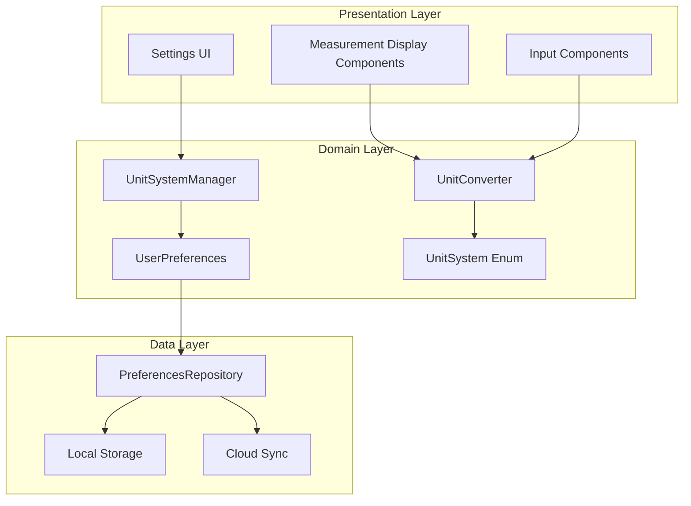

# Design Document

## Overview

The Unit System Preferences feature extends the Eunio health tracking application to support both metric and imperial measurement systems. The design follows the existing clean architecture pattern with shared business logic, platform-specific implementations, and consistent data storage. The feature integrates seamlessly with the current User model and settings infrastructure while providing real-time unit conversion throughout the app.

## Architecture

### High-Level Architecture



### Integration with Existing Architecture

The unit system preferences integrate with the existing Eunio architecture by:
- Extending the User model to include unit preferences
- Adding preference management to the existing repository pattern
- Utilizing the current dependency injection setup with Koin
- Following the established error handling patterns
- Maintaining the offline-first data strategy

## Components and Interfaces

### Core Domain Models

#### UnitSystem Enum
```kotlin
@Serializable
enum class UnitSystem(val displayName: String) {
    METRIC("Metric"),
    IMPERIAL("Imperial");
    
    companion object {
        fun fromLocale(locale: String): UnitSystem {
            return when (locale.uppercase()) {
                "US", "LR", "MM" -> IMPERIAL // United States, Liberia, Myanmar
                else -> METRIC
            }
        }
    }
}
```

#### Extended User Model
```kotlin
@Serializable
data class User(
    val id: String,
    val email: String,
    val name: String,
    val onboardingComplete: Boolean = false,
    val primaryGoal: HealthGoal,
    val unitSystem: UnitSystem = UnitSystem.METRIC,
    val createdAt: Instant,
    val updatedAt: Instant
)
```

#### UserPreferences Model
```kotlin
@Serializable
data class UserPreferences(
    val userId: String,
    val unitSystem: UnitSystem,
    val isManuallySet: Boolean = false,
    val lastModified: Instant,
    val syncStatus: SyncStatus = SyncStatus.PENDING
)

enum class SyncStatus {
    SYNCED, PENDING, FAILED
}
```

### Unit Conversion System

#### UnitConverter Interface
```kotlin
interface UnitConverter {
    fun convertWeight(value: Double, from: UnitSystem, to: UnitSystem): Double
    fun convertDistance(value: Double, from: UnitSystem, to: UnitSystem): Double
    fun convertTemperature(value: Double, from: UnitSystem, to: UnitSystem): Double
    fun formatWeight(value: Double, unitSystem: UnitSystem): String
    fun formatDistance(value: Double, unitSystem: UnitSystem): String
    fun formatTemperature(value: Double, unitSystem: UnitSystem): String
}
```

#### UnitConverterImpl
```kotlin
class UnitConverterImpl : UnitConverter {
    
    companion object {
        private const val KG_TO_LBS = 2.20462
        private const val KM_TO_MILES = 0.621371
        private const val DECIMAL_PLACES = 2
    }
    
    override fun convertWeight(value: Double, from: UnitSystem, to: UnitSystem): Double {
        if (from == to) return value
        
        return when {
            from == UnitSystem.METRIC && to == UnitSystem.IMPERIAL -> 
                roundToDecimalPlaces(value * KG_TO_LBS, DECIMAL_PLACES)
            from == UnitSystem.IMPERIAL && to == UnitSystem.METRIC -> 
                roundToDecimalPlaces(value / KG_TO_LBS, DECIMAL_PLACES)
            else -> value
        }
    }
    
    override fun convertDistance(value: Double, from: UnitSystem, to: UnitSystem): Double {
        if (from == to) return value
        
        return when {
            from == UnitSystem.METRIC && to == UnitSystem.IMPERIAL -> 
                roundToDecimalPlaces(value * KM_TO_MILES, DECIMAL_PLACES)
            from == UnitSystem.IMPERIAL && to == UnitSystem.METRIC -> 
                roundToDecimalPlaces(value / KM_TO_MILES, DECIMAL_PLACES)
            else -> value
        }
    }
    
    override fun convertTemperature(value: Double, from: UnitSystem, to: UnitSystem): Double {
        if (from == to) return value
        
        return when {
            from == UnitSystem.METRIC && to == UnitSystem.IMPERIAL -> 
                roundToDecimalPlaces((value * 9.0 / 5.0) + 32, DECIMAL_PLACES)
            from == UnitSystem.IMPERIAL && to == UnitSystem.METRIC -> 
                roundToDecimalPlaces((value - 32) * 5.0 / 9.0, DECIMAL_PLACES)
            else -> value
        }
    }
    
    override fun formatWeight(value: Double, unitSystem: UnitSystem): String {
        val unit = if (unitSystem == UnitSystem.METRIC) "kg" else "lbs"
        return "${roundToDecimalPlaces(value, DECIMAL_PLACES)} $unit"
    }
    
    override fun formatDistance(value: Double, unitSystem: UnitSystem): String {
        val unit = if (unitSystem == UnitSystem.METRIC) "km" else "miles"
        return "${roundToDecimalPlaces(value, DECIMAL_PLACES)} $unit"
    }
    
    override fun formatTemperature(value: Double, unitSystem: UnitSystem): String {
        val unit = if (unitSystem == UnitSystem.METRIC) "°C" else "°F"
        return "${roundToDecimalPlaces(value, DECIMAL_PLACES)}$unit"
    }
    
    private fun roundToDecimalPlaces(value: Double, places: Int): Double {
        val factor = kotlin.math.pow(10.0, places.toDouble())
        return kotlin.math.round(value * factor) / factor
    }
}
```

### Preference Management System

#### UnitSystemManager
```kotlin
interface UnitSystemManager {
    suspend fun getCurrentUnitSystem(): UnitSystem
    suspend fun setUnitSystem(unitSystem: UnitSystem, isManuallySet: Boolean = true): Result<Unit>
    suspend fun initializeFromLocale(locale: String): UnitSystem
    fun observeUnitSystemChanges(): Flow<UnitSystem>
}
```

#### UnitSystemManagerImpl
```kotlin
class UnitSystemManagerImpl(
    private val preferencesRepository: PreferencesRepository,
    private val userRepository: UserRepository
) : UnitSystemManager {
    
    private val _unitSystemFlow = MutableStateFlow(UnitSystem.METRIC)
    
    override suspend fun getCurrentUnitSystem(): UnitSystem {
        return preferencesRepository.getUserPreferences()
            .getOrNull()?.unitSystem ?: UnitSystem.METRIC
    }
    
    override suspend fun setUnitSystem(unitSystem: UnitSystem, isManuallySet: Boolean): Result<Unit> {
        return try {
            val userId = getCurrentUserId()
            val preferences = UserPreferences(
                userId = userId,
                unitSystem = unitSystem,
                isManuallySet = isManuallySet,
                lastModified = Clock.System.now()
            )
            
            preferencesRepository.saveUserPreferences(preferences)
                .onSuccess { 
                    _unitSystemFlow.value = unitSystem
                    updateUserModel(unitSystem)
                }
        } catch (e: Exception) {
            Result.failure(AppError.ValidationError("Failed to set unit system: ${e.message}"))
        }
    }
    
    override suspend fun initializeFromLocale(locale: String): UnitSystem {
        val existingPrefs = preferencesRepository.getUserPreferences().getOrNull()
        
        // Only apply locale-based default if user hasn't manually set a preference
        return if (existingPrefs?.isManuallySet == true) {
            existingPrefs.unitSystem
        } else {
            val localeBasedSystem = UnitSystem.fromLocale(locale)
            setUnitSystem(localeBasedSystem, isManuallySet = false)
            localeBasedSystem
        }
    }
    
    override fun observeUnitSystemChanges(): Flow<UnitSystem> = _unitSystemFlow.asStateFlow()
    
    private suspend fun getCurrentUserId(): String {
        return userRepository.getCurrentUser().getOrNull()?.id 
            ?: throw IllegalStateException("No authenticated user found")
    }
    
    private suspend fun updateUserModel(unitSystem: UnitSystem) {
        userRepository.getCurrentUser().getOrNull()?.let { user ->
            val updatedUser = user.copy(
                unitSystem = unitSystem,
                updatedAt = Clock.System.now()
            )
            userRepository.updateUser(updatedUser)
        }
    }
}
```

### Repository Layer

#### PreferencesRepository Interface
```kotlin
interface PreferencesRepository {
    suspend fun getUserPreferences(): Result<UserPreferences?>
    suspend fun saveUserPreferences(preferences: UserPreferences): Result<Unit>
    suspend fun syncPreferences(): Result<Unit>
    suspend fun clearPreferences(): Result<Unit>
}
```

#### PreferencesRepositoryImpl
```kotlin
class PreferencesRepositoryImpl(
    private val localDataSource: PreferencesLocalDataSource,
    private val remoteDataSource: PreferencesRemoteDataSource,
    private val networkConnectivity: NetworkConnectivity
) : PreferencesRepository {
    
    override suspend fun getUserPreferences(): Result<UserPreferences?> {
        return try {
            // Try local first
            val localPrefs = localDataSource.getPreferences()
            if (localPrefs != null) {
                return Result.success(localPrefs)
            }
            
            // Fallback to remote if connected
            if (networkConnectivity.isConnected()) {
                val remotePrefs = remoteDataSource.getPreferences().getOrNull()
                remotePrefs?.let { 
                    localDataSource.savePreferences(it) // Cache locally
                }
                Result.success(remotePrefs)
            } else {
                Result.success(null)
            }
        } catch (e: Exception) {
            Result.failure(AppError.DataSyncError("Failed to get preferences: ${e.message}"))
        }
    }
    
    override suspend fun saveUserPreferences(preferences: UserPreferences): Result<Unit> {
        return try {
            // Always save locally first
            localDataSource.savePreferences(preferences)
            
            // Sync to remote if connected
            if (networkConnectivity.isConnected()) {
                remoteDataSource.savePreferences(preferences)
                    .onSuccess { 
                        localDataSource.markAsSynced(preferences.userId)
                    }
            }
            
            Result.success(Unit)
        } catch (e: Exception) {
            Result.failure(AppError.DataSyncError("Failed to save preferences: ${e.message}"))
        }
    }
    
    override suspend fun syncPreferences(): Result<Unit> {
        return try {
            if (!networkConnectivity.isConnected()) {
                return Result.failure(AppError.NetworkError("No network connection available"))
            }
            
            val localPrefs = localDataSource.getPendingSyncPreferences()
            localPrefs.forEach { preferences ->
                remoteDataSource.savePreferences(preferences)
                    .onSuccess { 
                        localDataSource.markAsSynced(preferences.userId)
                    }
                    .onFailure { error ->
                        return Result.failure(AppError.DataSyncError("Sync failed: ${error.message}"))
                    }
            }
            
            Result.success(Unit)
        } catch (e: Exception) {
            Result.failure(AppError.DataSyncError("Sync operation failed: ${e.message}"))
        }
    }
    
    override suspend fun clearPreferences(): Result<Unit> {
        return try {
            localDataSource.clearPreferences()
            if (networkConnectivity.isConnected()) {
                remoteDataSource.clearPreferences()
            }
            Result.success(Unit)
        } catch (e: Exception) {
            Result.failure(AppError.DataSyncError("Failed to clear preferences: ${e.message}"))
        }
    }
}
```

## Data Models

### Local Storage Schema Extension

```sql
-- Migration script for adding unit system support
-- Migration version: 2

-- Add unitSystem column to existing User table
ALTER TABLE User ADD COLUMN unitSystem TEXT NOT NULL DEFAULT 'METRIC';

-- Create new UserPreferences table
CREATE TABLE UserPreferences (
    userId TEXT PRIMARY KEY,
    unitSystem TEXT NOT NULL DEFAULT 'METRIC',
    isManuallySet INTEGER NOT NULL DEFAULT 0,
    lastModified INTEGER NOT NULL,
    syncStatus TEXT NOT NULL DEFAULT 'PENDING',
    FOREIGN KEY (userId) REFERENCES User(id) ON DELETE CASCADE
);

-- Create index for faster preference lookups
CREATE INDEX idx_user_preferences_sync_status ON UserPreferences(syncStatus);
```

### Firestore Schema Extension

```javascript
// Extend existing user document - single source of truth
users/{userId} {
    // ... existing fields
    unitSystem: "METRIC" | "IMPERIAL",
    unitSystemManuallySet: boolean,
    unitSystemLastModified: Timestamp
}

// Separate preferences collection for complex preference data
users/{userId}/preferences/unitSystem {
    unitSystem: "METRIC" | "IMPERIAL",
    isManuallySet: boolean,
    lastModified: Timestamp,
    syncStatus: "SYNCED" | "PENDING" | "FAILED"
}
```

## Error Handling

### Unit System Specific Errors

```kotlin
sealed class UnitSystemError : AppError() {
    data class ConversionError(override val message: String) : UnitSystemError()
    data class PreferencesSyncError(override val message: String) : UnitSystemError()
    data class LocaleDetectionError(override val message: String) : UnitSystemError()
}

class UnitSystemErrorHandler : ErrorHandler() {
    fun handleUnitSystemError(error: Throwable): UnitSystemError {
        return when (error) {
            is NumberFormatException -> UnitSystemError.ConversionError("Invalid number format for conversion")
            is IllegalArgumentException -> UnitSystemError.ConversionError("Invalid unit system conversion")
            else -> UnitSystemError.PreferencesSyncError(error.message ?: "Unknown preferences error")
        }
    }
}
```

## Testing Strategy

### Unit Testing

#### Conversion Logic Tests
```kotlin
class UnitConverterTest {
    private val converter = UnitConverterImpl()
    
    @Test
    fun `convert weight from kg to lbs`() {
        val result = converter.convertWeight(1.0, UnitSystem.METRIC, UnitSystem.IMPERIAL)
        assertEquals(2.20, result, 0.01)
    }
    
    @Test
    fun `convert temperature from celsius to fahrenheit`() {
        val result = converter.convertTemperature(0.0, UnitSystem.METRIC, UnitSystem.IMPERIAL)
        assertEquals(32.0, result, 0.01)
    }
    
    @Test
    fun `rounding precision is maintained`() {
        val result = converter.convertWeight(1.234567, UnitSystem.METRIC, UnitSystem.IMPERIAL)
        assertEquals(2.72, result, 0.01) // Should round to 2 decimal places
    }
}
```

#### Preferences Management Tests
```kotlin
class UnitSystemManagerTest {
    private val mockPreferencesRepo = mockk<PreferencesRepository>()
    private val mockUserRepo = mockk<UserRepository>()
    private val manager = UnitSystemManagerImpl(mockPreferencesRepo, mockUserRepo)
    
    @Test
    fun `setting unit system updates preferences and user model`() = runTest {
        // Test implementation
    }
    
    @Test
    fun `locale-based initialization works correctly`() = runTest {
        // Test implementation
    }
}
```

### Integration Testing

#### End-to-End Preference Flow
```kotlin
class UnitSystemIntegrationTest {
    @Test
    fun `changing unit system updates all UI components`() {
        // Test that changing preference in settings immediately updates all measurement displays
    }
    
    @Test
    fun `offline preference changes sync when connectivity restored`() {
        // Test offline behavior and sync recovery
    }
}
```

## UI Integration

### Settings Screen Integration

```kotlin
@Composable
fun UnitSystemSettingItem(
    currentUnitSystem: UnitSystem,
    onUnitSystemChanged: (UnitSystem) -> Unit,
    modifier: Modifier = Modifier
) {
    Column(modifier = modifier) {
        Text(
            text = "Unit System",
            style = MaterialTheme.typography.titleMedium
        )
        
        Spacer(modifier = Modifier.height(8.dp))
        
        Row(
            modifier = Modifier.fillMaxWidth(),
            horizontalArrangement = Arrangement.spacedBy(16.dp)
        ) {
            UnitSystemOption(
                unitSystem = UnitSystem.METRIC,
                isSelected = currentUnitSystem == UnitSystem.METRIC,
                onSelected = onUnitSystemChanged,
                modifier = Modifier.weight(1f)
            )
            
            UnitSystemOption(
                unitSystem = UnitSystem.IMPERIAL,
                isSelected = currentUnitSystem == UnitSystem.IMPERIAL,
                onSelected = onUnitSystemChanged,
                modifier = Modifier.weight(1f)
            )
        }
    }
}
```

### Measurement Display Components

```kotlin
@Composable
fun WeightDisplay(
    weightInKg: Double,
    unitSystem: UnitSystem,
    modifier: Modifier = Modifier
) {
    val converter = remember { UnitConverterImpl() }
    val displayValue = remember(weightInKg, unitSystem) {
        converter.convertWeight(weightInKg, UnitSystem.METRIC, unitSystem)
    }
    val unit = if (unitSystem == UnitSystem.METRIC) "kg" else "lbs"
    
    Text(
        text = "${displayValue} $unit",
        modifier = modifier
    )
}
```

## Performance Considerations

### Caching Strategy
- Unit system preference cached in memory for immediate access
- Conversion results cached for frequently displayed values
- Lazy initialization of conversion components

### Optimization Techniques
- Batch conversion operations when updating multiple UI elements
- Use StateFlow for reactive unit system changes
- Minimize database queries by caching preferences locally

## Security and Privacy

### Data Protection
- Unit preferences are non-sensitive but follow same encryption standards
- Local storage uses platform-specific secure storage mechanisms
- Cloud sync follows existing Firebase security rules

### Privacy Compliance
- Unit system preference is considered non-PII
- Follows existing HIPAA compliance patterns for data handling
- User consent handled through existing privacy policy

## Dependency Injection

### Koin Module Extension

```kotlin
val unitSystemModule = module {
    // Unit Converter
    single<UnitConverter> { UnitConverterImpl() }
    
    // Unit System Manager
    single<UnitSystemManager> { 
        UnitSystemManagerImpl(
            preferencesRepository = get(),
            userRepository = get()
        )
    }
    
    // Preferences Repository
    single<PreferencesRepository> {
        PreferencesRepositoryImpl(
            localDataSource = get(),
            remoteDataSource = get(),
            networkConnectivity = get()
        )
    }
    
    // Data Sources
    single<PreferencesLocalDataSource> { 
        PreferencesLocalDataSourceImpl(get()) // DatabaseManager
    }
    single<PreferencesRemoteDataSource> { 
        PreferencesRemoteDataSourceImpl(get()) // FirestoreService
    }
}
```

## Updated UI Components

### Enhanced Measurement Display Components

```kotlin
@Composable
fun WeightDisplay(
    weightInKg: Double,
    unitSystem: UnitSystem,
    modifier: Modifier = Modifier
) {
    val converter = koinInject<UnitConverter>()
    val displayValue = remember(weightInKg, unitSystem) {
        converter.convertWeight(weightInKg, UnitSystem.METRIC, unitSystem)
    }
    
    Text(
        text = converter.formatWeight(displayValue, unitSystem),
        modifier = modifier
    )
}

@Composable
fun DistanceDisplay(
    distanceInKm: Double,
    unitSystem: UnitSystem,
    modifier: Modifier = Modifier
) {
    val converter = koinInject<UnitConverter>()
    val displayValue = remember(distanceInKm, unitSystem) {
        converter.convertDistance(distanceInKm, UnitSystem.METRIC, unitSystem)
    }
    
    Text(
        text = converter.formatDistance(displayValue, unitSystem),
        modifier = modifier
    )
}

@Composable
fun TemperatureDisplay(
    temperatureInCelsius: Double,
    unitSystem: UnitSystem,
    modifier: Modifier = Modifier
) {
    val converter = koinInject<UnitConverter>()
    val displayValue = remember(temperatureInCelsius, unitSystem) {
        converter.convertTemperature(temperatureInCelsius, UnitSystem.METRIC, unitSystem)
    }
    
    Text(
        text = converter.formatTemperature(displayValue, unitSystem),
        modifier = modifier
    )
}
```

This design provides a comprehensive, scalable solution for unit system preferences that integrates seamlessly with the existing Eunio architecture while maintaining performance, security, and user experience standards.