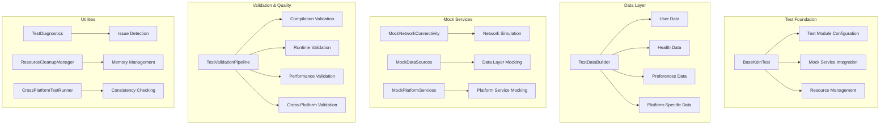

# Test Infrastructure Documentation Index

## Overview

This document serves as the central index for all test infrastructure documentation. The test infrastructure has been completely rebuilt to provide a robust, maintainable, and efficient testing foundation for the Eunio Health App.

## Documentation Structure

### 📋 Core Documentation

1. **[Test Writing Guidelines](TEST_WRITING_GUIDELINES.md)**
   - Comprehensive guide for writing consistent, maintainable tests
   - Test structure and organization patterns
   - Best practices and anti-patterns
   - Code review checklist

2. **[Mock Service Usage Patterns](MOCK_SERVICE_USAGE_PATTERNS.md)**
   - Complete guide to using mock services
   - Configuration patterns and examples
   - Advanced mock behaviors and verification
   - Platform-specific mock usage

3. **[Test Data Creation Examples](TEST_DATA_CREATION_EXAMPLES.md)**
   - Comprehensive examples of proper test data creation
   - TestDataBuilder usage patterns
   - Realistic data scenarios and edge cases
   - Performance considerations

4. **[Troubleshooting Guide](TEST_INFRASTRUCTURE_TROUBLESHOOTING_GUIDE.md)**
   - Solutions for common test infrastructure issues
   - Diagnostic tools and debugging techniques
   - Platform-specific problem resolution
   - Performance optimization strategies

### 🔧 Implementation Guides

5. **[Koin Test Infrastructure Summary](KOIN_TEST_INFRASTRUCTURE_SUMMARY.md)**
   - Dependency injection setup for tests
   - Test module configuration
   - BaseKoinTest usage patterns

6. **[Mock Service Koin Integration Summary](MOCK_SERVICE_KOIN_INTEGRATION_SUMMARY.md)**
   - Integration of mock services with Koin DI
   - Service replacement patterns
   - Configuration management

7. **[Test Data Builder Usage](TEST_DATA_BUILDER_USAGE.md)**
   - Detailed TestDataBuilder API documentation
   - Builder patterns and factory methods
   - Data validation and consistency

### 🏗️ Infrastructure Components

8. **[Error Handling Infrastructure Guide](ERROR_HANDLING_INFRASTRUCTURE_GUIDE.md)**
   - Resilient test execution patterns
   - Error recovery mechanisms
   - Diagnostic and monitoring tools

9. **[Automated Test Validation Pipeline Guide](AUTOMATED_TEST_VALIDATION_PIPELINE_GUIDE.md)**
   - Continuous test validation
   - Quality assurance automation
   - CI/CD integration patterns

10. **[Performance Optimization Guide](PERFORMANCE_OPTIMIZATION_GUIDE.md)**
    - Test execution performance optimization
    - Resource management strategies
    - Memory leak prevention

### 📱 Platform-Specific Guides

11. **[Android Test Infrastructure Summary](ANDROID_TEST_INFRASTRUCTURE_SUMMARY.md)**
    - Android-specific test setup and utilities
    - Context mocking and platform services
    - Integration with Android testing frameworks

12. **[iOS Test Compatibility Summary](IOS_TEST_COMPATIBILITY_SUMMARY.md)**
    - iOS-specific test configuration
    - Platform service mocking
    - CI/CD compatibility for iOS tests

## Quick Start Guide

### For New Developers

1. **Start Here**: Read [Test Writing Guidelines](TEST_WRITING_GUIDELINES.md)
2. **Learn Mock Usage**: Review [Mock Service Usage Patterns](MOCK_SERVICE_USAGE_PATTERNS.md)
3. **Create Test Data**: Study [Test Data Creation Examples](TEST_DATA_CREATION_EXAMPLES.md)
4. **When Issues Arise**: Consult [Troubleshooting Guide](TEST_INFRASTRUCTURE_TROUBLESHOOTING_GUIDE.md)

### For Existing Developers

1. **Migration Guide**: Check the troubleshooting guide for updating existing tests
2. **New Patterns**: Review mock service and test data patterns
3. **Performance**: Apply performance optimization techniques
4. **Platform Issues**: Use platform-specific guides for Android/iOS problems

## Key Improvements Implemented

### ✅ Compilation Issues Resolved

- **376 compilation errors fixed** across all test files
- **Updated mock implementations** to match current interfaces
- **Fixed data model compatibility** with current constructors and field names
- **Resolved dependency issues** with proper imports and package structure

### ✅ Infrastructure Enhancements

- **Centralized test data creation** with TestDataBuilder
- **Comprehensive mock service framework** with Koin integration
- **Performance-optimized test execution** with resource management
- **Cross-platform test compatibility** for Android and iOS
- **Automated validation pipeline** for continuous quality assurance

### ✅ Developer Experience Improvements

- **Clear documentation** with examples and best practices
- **Diagnostic tools** for troubleshooting test issues
- **Consistent patterns** across all test types
- **Error recovery mechanisms** for resilient test execution

## Test Infrastructure Architecture



## Usage Examples

### Basic Test Structure

```kotlin
class MyFeatureTest : BaseKoinTest() {
    
    @BeforeTest
    fun setup() {
        super.setup() // Initialize Koin with test modules
    }
    
    @AfterTest
    fun teardown() {
        super.teardown() // Clean up resources
    }
    
    @Test
    fun `feature works correctly`() {
        // Create test data
        val user = TestDataBuilder.createUser()
        
        // Configure mocks
        val mockService = get<MyService>() as MockMyService
        mockService.configure(/* test scenario */)
        
        // Test the feature
        val result = featureUnderTest.execute(user)
        
        // Verify results
        assertTrue(result.isSuccess)
    }
}
```

### Mock Service Configuration

```kotlin
@Test
fun `handles network failure gracefully`() {
    // Get mock from Koin
    val mockNetwork = get<NetworkConnectivity>() as MockNetworkConnectivity
    
    // Configure failure scenario
    mockNetwork.apply {
        isConnected = false
        shouldThrowException = true
        exceptionToThrow = NetworkException("Connection failed")
    }
    
    // Test error handling
    val service = get<SyncService>()
    val result = service.syncData()
    
    assertTrue(result.isFailure)
    assertTrue(result.exceptionOrNull() is NetworkException)
}
```

### Test Data Creation

```kotlin
@Test
fun `processes user health data correctly`() {
    // Create realistic test data
    val user = TestDataBuilder.createUser(
        healthProfile = TestDataBuilder.createHealthProfile(
            conditions = listOf(HealthCondition.PCOS),
            medications = listOf("Metformin")
        )
    )
    
    val healthData = TestDataBuilder.createHealthDataTimeSeries(
        userId = user.id,
        startDate = LocalDate.now().minus(90.days),
        endDate = LocalDate.now(),
        dataTypes = setOf(HealthDataType.MENSTRUAL_CYCLE, HealthDataType.MOOD)
    )
    
    // Test data processing
    val analysis = healthAnalyzer.analyze(user, healthData)
    
    assertNotNull(analysis)
    assertTrue(analysis.insights.isNotEmpty())
}
```

## Maintenance and Updates

### Regular Maintenance Tasks

1. **Weekly**: Run comprehensive test suite validation
2. **Monthly**: Review and update mock service configurations
3. **Quarterly**: Performance optimization review
4. **As Needed**: Update documentation when interfaces change

### Updating Documentation

When making changes to the test infrastructure:

1. **Update relevant documentation files**
2. **Add examples for new patterns**
3. **Update troubleshooting guide with new issues**
4. **Validate all examples still work**

### Version Compatibility

This documentation is current as of the test infrastructure fixes implementation. When updating:

- Check interface compatibility
- Update mock implementations
- Validate test data builders
- Test cross-platform compatibility

## Support and Feedback

### Getting Help

1. **Check Documentation**: Start with relevant guide from this index
2. **Use Diagnostic Tools**: Run TestDiagnostics for issue identification
3. **Review Examples**: Look at working tests for patterns
4. **Consult Troubleshooting**: Use the troubleshooting guide for common issues

### Reporting Issues

When reporting test infrastructure issues:

1. **Provide Context**: Include test file, method, and error message
2. **Include Diagnostics**: Run and include TestDiagnostics output
3. **Minimal Reproduction**: Create minimal test case that reproduces the issue
4. **Environment Details**: Include platform, CI/CD environment, etc.

### Contributing Improvements

To contribute to the test infrastructure:

1. **Follow Patterns**: Use established patterns and conventions
2. **Update Documentation**: Include documentation updates with changes
3. **Add Tests**: Test your infrastructure improvements
4. **Consider Compatibility**: Ensure changes work across platforms

## Conclusion

This test infrastructure provides a solid foundation for reliable, maintainable testing across the Eunio Health App. The comprehensive documentation, diagnostic tools, and established patterns should enable efficient test development and maintenance.

For questions or issues not covered in this documentation, use the diagnostic tools and troubleshooting guide to identify and resolve problems systematically.